# 🌑 Project Architecture Document

## L'Artisan Baking Atelier — *The Noir Artisanal Codex*

<div align="center">

```
╔══════════════════════════════════════════════════════════════════════╗
║                                                                      ║
║        ◆                                                             ║
║       ◆ ◆          P R O J E C T                                    ║
║      ◆   ◆                                                          ║
║       ◆ ◆          A R C H I T E C T U R E                          ║
║        ◆                                                             ║
║                    D O C U M E N T                                   ║
║                                                                      ║
║                    ─── Single Source of Truth ───                     ║
║                                                                      ║
╚══════════════════════════════════════════════════════════════════════╝
```

</div>

| Field | Value |
|-------|-------|
| **Document Version** | 1.0.0 |
| **Last Updated** | 2026-02-06 |
| **Status** | Production Ready |
| **Application Type** | Single-Page Application (SPA) |
| **Build Output** | Single self-contained `dist/index.html` |
| **Design System** | "Noir Artisanal Codex" v1.0 |

---

## Table of Contents

- [1. Executive Summary](#1-executive-summary)
- [2. Design Philosophy & Aesthetic Direction](#2-design-philosophy--aesthetic-direction)
- [3. Tech Stack & Configuration](#3-tech-stack--configuration)
  - [3.1 Dependency Matrix](#31-dependency-matrix)
  - [3.2 Build Configuration](#32-build-configuration)
  - [3.3 TypeScript Configuration](#33-typescript-configuration)
  - [3.4 Path Aliases](#34-path-aliases)
- [4. File Hierarchy & Architecture](#4-file-hierarchy--architecture)
  - [4.1 Project Tree](#41-project-tree)
  - [4.2 Key Files Reference](#42-key-files-reference)
  - [4.3 Component Taxonomy (Atomic Design)](#43-component-taxonomy-atomic-design)
- [5. Design System Implementation](#5-design-system-implementation)
  - [5.1 Color Palette — Dark Mode](#51-color-palette--dark-mode)
  - [5.2 Color Palette — Light Mode](#52-color-palette--light-mode)
  - [5.3 Semantic Colors](#53-semantic-colors)
  - [5.4 Typography System](#54-typography-system)
  - [5.5 Easing Curves](#55-easing-curves)
  - [5.6 Shadow System](#56-shadow-system)
  - [5.7 Spacing](#57-spacing)
  - [5.8 Atmospheric Layering](#58-atmospheric-layering)
  - [5.9 Animation Keyframes](#59-animation-keyframes)
  - [5.10 Stagger Delay System](#510-stagger-delay-system)
  - [5.11 CSS Component Classes](#511-css-component-classes)
- [6. Data Architecture & TypeScript Models](#6-data-architecture--typescript-models)
  - [6.1 Course Model](#61-course-model)
  - [6.2 Mentor Model](#62-mentor-model)
  - [6.3 Testimonial Model](#63-testimonial-model)
  - [6.4 Navigation Model](#64-navigation-model)
  - [6.5 Footer Model](#65-footer-model)
  - [6.6 Form State Model](#66-form-state-model)
  - [6.7 Particle Model](#67-particle-model)
  - [6.8 Theme Model](#68-theme-model)
  - [6.9 Scroll Animation Options](#69-scroll-animation-options)
- [7. Component Deep-Dive](#7-component-deep-dive)
  - [7.1 App.tsx — Root Compositor](#71-apptsx--root-compositor)
  - [7.2 Navigation.tsx — App Shell](#72-navigationtsx--app-shell)
  - [7.3 HeroSection.tsx — Cinematic Landing](#73-herosectiontsx--cinematic-landing)
  - [7.4 CoursesSection.tsx — Course Grid](#74-coursessectiontsx--course-grid)
  - [7.5 MentorsSection.tsx — Mentor Grid](#75-mentorssectiontsx--mentor-grid)
  - [7.6 TestimonialsSection.tsx — Social Proof](#76-testimonialssectiontsx--social-proof)
  - [7.7 NewsletterSection.tsx — Form State Machine](#77-newslettersectiontsx--form-state-machine)
  - [7.8 Footer.tsx — Heritage Layout](#78-footertsx--heritage-layout)
  - [7.9 Atomic Components](#79-atomic-components)
- [8. Custom Hooks Deep-Dive](#8-custom-hooks-deep-dive)
  - [8.1 useTheme](#81-usetheme)
  - [8.2 useScrollAnimation](#82-usescrollanimation)
  - [8.3 useHeritageParticles](#83-useheritageparticles)
- [9. Application Flow Diagrams](#9-application-flow-diagrams)
  - [9.1 User Interaction Flow](#91-user-interaction-flow)
  - [9.2 Scroll Animation Lifecycle](#92-scroll-animation-lifecycle)
  - [9.3 Newsletter Form State Machine](#93-newsletter-form-state-machine)
  - [9.4 Particle Physics Engine Flow](#94-particle-physics-engine-flow)
  - [9.5 Theme Toggle Logic](#95-theme-toggle-logic)
  - [9.6 Navigation Scroll Spy Sequence](#96-navigation-scroll-spy-sequence)
  - [9.7 Component Composition Hierarchy](#97-component-composition-hierarchy)
- [10. Styling Architecture](#10-styling-architecture)
  - [10.1 Tailwind v4 Approach](#101-tailwind-v4-approach)
  - [10.2 CSS Layer Strategy](#102-css-layer-strategy)
  - [10.3 Theme Implementation Pattern](#103-theme-implementation-pattern)
  - [10.4 The cn() Utility](#104-the-cn-utility)
- [11. Performance & Accessibility](#11-performance--accessibility)
  - [11.1 Performance Strategy](#111-performance-strategy)
  - [11.2 Accessibility Compliance](#112-accessibility-compliance)
- [12. Verification & Validation](#12-verification--validation)
- [13. Developer Onboarding Guide](#13-developer-onboarding-guide)
  - [13.1 Setup](#131-setup)
  - [13.2 Adding a New Section](#132-adding-a-new-section)
  - [13.3 Adding New Design Tokens](#133-adding-new-design-tokens)
  - [13.4 Adding New Data](#134-adding-new-data)
  - [13.5 Code Standards Checklist](#135-code-standards-checklist)
- [14. Deployment Guide](#14-deployment-guide)
  - [14.1 Build Process](#141-build-process)
  - [14.2 Static File Hosting](#142-static-file-hosting)
  - [14.3 Vercel](#143-vercel)
  - [14.4 Netlify](#144-netlify)
  - [14.5 Docker](#145-docker)
  - [14.6 GitHub Pages](#146-github-pages)
- [15. Glossary](#15-glossary)

---

## 1. Executive Summary

**L'Artisan Baking Atelier** is a high-end, cinematic single-page e-commerce platform for a Singapore-based artisan baking school. Built as a frontend-only React SPA, it implements the **"Noir Artisanal Codex"** — a bespoke design system that rejects generic UI patterns in favor of deep atmospheric aesthetics, Peranakan cultural geometry, physics-based particle interactions, and letterpress typography.

### What This Application Does

| Capability | Description |
|------------|-------------|
| **Product Showcase** | Displays 4 artisan baking courses with difficulty badges, durations, and descriptions |
| **Team Presentation** | Features 3 mentors with portraits, accolades, and concentric ring hover effects |
| **Social Proof** | Shows 3 student testimonials with floating quotation marks and location context |
| **Newsletter Signup** | Email subscription form with a 4-state machine (idle → loading → success → error) |
| **Theme Switching** | Full dark/light mode with system preference detection and `localStorage` persistence |
| **Atmospheric Experience** | 4-layer background composite, film grain overlay, flour particle physics engine |
| **Cinematic Navigation** | Glassmorphic scroll-spy navbar with mobile overlay and smooth section scrolling |

### Key Technical Decisions

| Decision | Rationale |
|----------|-----------|
| **Zero JS animation libraries** | All transitions are CSS-native (`@keyframes` + `transition`). Canvas API used only for particle physics. Eliminates GSAP/Framer Motion bundle weight. |
| **Single-file build** | `vite-plugin-singlefile` inlines all assets into one `index.html`. Fully portable — can be opened directly in a browser without a server. |
| **CSS-first design system** | All tokens defined in `@theme` directive (Tailwind v4 CSS-native config). No `tailwind.config.js` file. No runtime CSS-in-JS. |
| **No external component library** | Every UI element is bespoke. No Bootstrap, Material, Shadcn, or Radix. This is intentional — the "Anti-Generic" pledge demands custom geometry and interaction patterns. |
| **TypeScript strict mode** | `strict: true`, `noUnusedLocals`, `noUnusedParameters`, `noFallthroughCasesInSwitch`. No `any` types anywhere. |

---

## 2. Design Philosophy & Aesthetic Direction

### The "Anti-Generic" Pledge

| Principle | Enforcement in This Codebase |
|-----------|------------------------------|
| **No template aesthetics** | Zero Bootstrap/Material/Shadcn components. Every element — from `CornerFlourish` SVG to `SectionDivider` geometry — is custom |
| **No safe typography** | Bodoni Moda (high-contrast serif) with CSS letterpress effect for headings; Instrument Sans for body. No Inter, Roboto, or system font primaries |
| **No timid color** | One dominant void (`#090807`) + one accent family (gold `#C9A84C`). No evenly-distributed pastel palettes |
| **No animation bloat** | Zero GSAP, Framer Motion, or Lottie. 9 custom `@keyframes` + CSS `transition` with 3 custom cubic-bezier curves |
| **Cultural intentionality** | Peranakan heritage patterns (7° diagonals from shophouse roof pitch) and interlocking diamond SVGs are structural, not decorative |

### Atmospheric Concept: "Nuit Éternelle" (Eternal Night)

The interface evokes a master pâtissier's private study at midnight — candlelight catching gold leaf on ancient recipe manuscripts, flour particles drifting like snow, each scroll revealing another chapter of the artisan's codex.

- **Dark Mode** ("Noir Codex"): Deep void `#090807` with volumetric gold light shafts, paper noise texture, and Peranakan tile gridlines
- **Light Mode** ("Day Atelier"): Warm parchment `#FCFBF7` with aged paper texture, deep gold `#B8860B` accents, and reduced grain opacity

---

## 3. Tech Stack & Configuration

### 3.1 Dependency Matrix

#### Production Dependencies

| Package | Version | Purpose |
|---------|---------|---------|
| `react` | 19.2.3 | UI library (functional components, hooks) |
| `react-dom` | 19.2.3 | DOM rendering via `createRoot` |
| `clsx` | 2.1.1 | Conditional className composition |
| `tailwind-merge` | 3.4.0 | Tailwind class conflict resolution |

#### Development Dependencies

| Package | Version | Purpose |
|---------|---------|---------|
| `typescript` | 5.9.3 | Static type checking (strict mode) |
| `vite` | 7.2.4 | Build tool, dev server, HMR |
| `tailwindcss` | 4.1.17 | CSS-first styling framework |
| `@tailwindcss/vite` | 4.1.17 | Tailwind CSS Vite plugin |
| `@vitejs/plugin-react` | 5.1.1 | React Fast Refresh for Vite |
| `vite-plugin-singlefile` | 2.3.0 | Inlines all assets into single HTML |
| `@types/react` | 19.2.7 | React type definitions |
| `@types/react-dom` | 19.2.3 | React DOM type definitions |
| `@types/node` | ^22.0.0 | Node.js type definitions (for path alias) |

### 3.2 Build Configuration

**File:** `vite.config.ts`

```typescript
// Key configuration points:
plugins: [react(), tailwindcss(), viteSingleFile()]
resolve.alias: { "@": path.resolve(__dirname, "src") }
```

- **3 plugins in order**: React Fast Refresh → Tailwind CSS processing → Single-file inlining
- **Path alias**: `@/` maps to `src/` for clean imports
- **Output**: `dist/index.html` — single file, all CSS/JS inlined

### 3.3 TypeScript Configuration

**File:** `tsconfig.json`

| Setting | Value | Impact |
|---------|-------|--------|
| `target` | `ES2020` | Modern JS output (optional chaining, nullish coalescing) |
| `strict` | `true` | Enables all strict type-checking options |
| `noUnusedLocals` | `true` | Build fails on unused variables |
| `noUnusedParameters` | `true` | Build fails on unused function parameters |
| `noFallthroughCasesInSwitch` | `true` | Prevents accidental switch case fallthrough |
| `moduleResolution` | `bundler` | Vite-compatible module resolution |
| `jsx` | `react-jsx` | Automatic JSX transform (no `import React` needed) |
| `isolatedModules` | `true` | Compatible with Vite's esbuild transpilation |

### 3.4 Path Aliases

| Alias | Resolves To | Example |
|-------|-------------|---------|
| `@/*` | `src/*` | `import { cn } from "@/utils/cn"` |

Configured in both `tsconfig.json` (`paths`) and `vite.config.ts` (`resolve.alias`).

---

## 4. File Hierarchy & Architecture

### 4.1 Project Tree

```
lartisan-baking-atelier/
│
├── index.html                              # HTML shell
├── package.json                            # Dependencies & scripts
├── tsconfig.json                           # TypeScript strict configuration
├── vite.config.ts                          # Vite + Tailwind + SingleFile config
├── README.md                               # Project README
├── Project_Architecture_Document.md        # This document
│
└── src/
    ├── main.tsx                            # Entry point — StrictMode + createRoot
    ├── App.tsx                             # Root compositor — atmosphere + sections
    ├── index.css                           # ★ Design System — all tokens, animations, styles
    │
    ├── utils/
    │   └── cn.ts                           # clsx + tailwind-merge utility
    │
    ├── hooks/
    │   ├── useTheme.ts                     # Dark/light toggle + persistence
    │   ├── useScrollAnimation.ts           # IntersectionObserver reveal hook
    │   └── useHeritageParticles.ts         # Canvas particle physics engine
    │
    └── components/
        ├── GrainOverlay.tsx                # [Atomic]    Film grain noise layer
        ├── CornerFlourish.tsx              # [Atomic]    Peranakan SVG ornament
        ├── ScrollToTopButton.tsx           # [Atomic]    Scroll-triggered back-to-top
        ├── SectionHeader.tsx               # [Molecule]  Reusable cinematic section header
        ├── Navigation.tsx                  # [Organism]  Scroll-spy nav + theme toggle + mobile
        ├── Footer.tsx                      # [Organism]  Heritage 4-column footer
        ├── HeroSection.tsx                 # [Template]  Particle-enhanced hero with stagger
        ├── CoursesSection.tsx              # [Template]  4-course grid with badge system
        ├── MentorsSection.tsx              # [Template]  3-mentor grid with concentric rings
        ├── TestimonialsSection.tsx         # [Template]  3-testimonial grid with floating quotes
        └── NewsletterSection.tsx           # [Template]  Email form with 4-state machine
```

### 4.2 Key Files Reference

| File | Role | Detailed Responsibility |
|------|------|------------------------|
| `index.html` | **HTML Shell** | Loads Google Fonts (Bodoni Moda + Instrument Sans) via `<link>` with `preconnect`. Applies FOUC prevention via `opacity:0` → `fadeInBody` keyframe (0.6s, 0.1s delay). Sets initial `class="dark"` on `<html>`. Mounts React at `<div id="root">`. |
| `src/index.css` | **Design System Core** | ~400 lines of CSS. Contains: all Tailwind `@theme` tokens (22 colors, 2 fonts, 3 easings, 5 shadows, 1 spacing), 4-layer atmospheric background (`atelier-atmosphere` with paper noise + Peranakan tile gridlines, `volumetric-light` with radial gold gradients), grain overlay animation, letterpress/shimmer typography effects, scroll reveal primitives, 9 `@keyframes`, 15+ component-level style classes, `prefers-reduced-motion` overrides, custom scrollbar, focus-visible styles. This is the heart of the design system. |
| `src/App.tsx` | **Root Compositor** | Composes the SPA layout in this order: `atelier-atmosphere` div → `volumetric-light` div → `GrainOverlay` → `Navigation` → `<main>` containing 5 sections (Hero, Courses, Mentors, Testimonials, Newsletter) → `Footer` → `ScrollToTopButton`. Manages theme state via `useTheme` hook and passes `isLight` boolean down to all children. |
| `src/hooks/useHeritageParticles.ts` | **Physics Engine** | Self-contained Canvas particle simulation managing 40–60 flour particles. Each particle has 10 properties (x, y, vx, vy, size, opacity, life, maxLife, rotation, rotationSpeed). Implements: mouse-proximity repulsion (120px radius, 0.15 force coefficient), velocity damping (0.995 per frame), life-cycle opacity fading (fade in 0–10% life, fade out 80–100%), boundary wrapping (±10px buffer), DPR-aware canvas sizing (capped at 2x), theme-aware color switching. Cleans up `requestAnimationFrame`, `resize`, and `mousemove` listeners on unmount. |
| `src/hooks/useScrollAnimation.ts` | **Reveal Controller** | Generic `IntersectionObserver` wrapper. Accepts `threshold` (default 0.15), `rootMargin` (default "0px"), `triggerOnce` (default true). Returns `{ ref: RefObject<HTMLDivElement>, isVisible: boolean }`. When `triggerOnce` is true, observer disconnects after first intersection. Used by every section component and card for entrance animations. |
| `src/hooks/useTheme.ts` | **Theme Manager** | Initialization cascade: `localStorage("lartisan-theme")` → `prefers-color-scheme` media query → `"dark"` fallback. Toggles `.light`/`.dark` class on `document.documentElement`. Persists choice to `localStorage`. Exposes `{ theme: "dark"|"light", isLight: boolean, toggleTheme: () => void }`. |
| `src/components/CornerFlourish.tsx` | **Design Token SVG** | Peranakan-inspired corner ornament with interlocking L-shapes, connecting diagonal line, and accent circle. Accepts `position` ("top-left" | "top-right" | "bottom-left" | "bottom-right") — achieved via CSS `scale` transforms. Stroke color adapts to `isLight` prop (`#8C7A3C` light, `#C9A84C` dark). Used in HeroSection (4 corners), NewsletterSection (4 corners), and CourseCard hover state (1 corner). |
| `src/components/Navigation.tsx` | **App Shell** | Fixed glassmorphic header. Internal state: `scrolled` (triggers at `scrollY > 50`), `activeSection` (scroll spy), `mobileOpen` (menu overlay). Scroll spy uses separate `IntersectionObserver` with `threshold: 0.3` and `rootMargin: "-80px 0px -40% 0px"`. 4 nav links: courses, mentors, testimonials (labeled "Voices"), newsletter (labeled "Atelier"). Logo: nested rotated `div`s creating Peranakan diamond mark. Theme toggle: moon SVG (dark mode) / sun SVG (light mode). Mobile: 3-line hamburger with CSS rotation-to-X animation, full-screen overlay with `backdrop-filter: blur(24px)`. |
| `src/components/NewsletterSection.tsx` | **Form State Machine** | 4-state form: `idle` (input enabled, "Subscribe" button) → `loading` (1500ms simulated API, spinner SVG, "Joining…" text, inputs disabled) → `success` (gold checkmark in circle, "Welcome to the atelier. Check your inbox.", terminal state) / `error` (border turns `#A04040`, shake animation, error message, auto-reset to idle after 3000ms). Uses `useScrollAnimation` with threshold 0.2. 4 `CornerFlourish` instances frame the form. |

### 4.3 Component Taxonomy (Atomic Design)

The project adapts Atomic Design for a single-page application:

```
┌─────────────────────────────────────────────────────────────────────────┐
│                                                                         │
│  ATOMS              Indivisible UI elements                            │
│  (3 components)     GrainOverlay — fixed film grain noise layer         │
│                     CornerFlourish — Peranakan SVG with 4 positions     │
│                     ScrollToTopButton — appears at scrollY > 600        │
│                                                                         │
│  MOLECULES          Composed atoms with a single responsibility        │
│  (1 component)      SectionHeader — overline label + decorative line    │
│                       + title (letterpress) + optional subtitle         │
│                                                                         │
│  ORGANISMS          Complex, self-contained UI regions                 │
│  (2 components)     Navigation — scroll spy + theme toggle + mobile    │
│                     Footer — 5-column grid + social links + copyright   │
│                                                                         │
│  TEMPLATES          Full page sections with data + layout + animation  │
│  (5 components)     HeroSection — particles + staggered title reveal   │
│                     CoursesSection — 4-card grid with badge system      │
│                     MentorsSection — 3-card grid with concentric rings  │
│                     TestimonialsSection — 3-card grid + floating quotes │
│                     NewsletterSection — 4-state email form              │
│                                                                         │
│  PAGE               Single composition of all layers                   │
│  (1 component)      App.tsx — atmosphere + navigation + main + footer  │
│                                                                         │
└─────────────────────────────────────────────────────────────────────────┘
```

---

## 5. Design System Implementation

All design tokens are defined in `src/index.css` using Tailwind CSS v4's `@theme` directive. **There is no `tailwind.config.js` file.** This is the CSS-native configuration approach.

### 5.1 Color Palette — Dark Mode ("Noir Codex")

| Token | CSS Variable | Hex | Usage |
|-------|-------------|-----|-------|
| `void` | `--color-void` | `#090807` | Page background — the "eternal night" base |
| `void-light` | `--color-void-light` | `#0F0E0C` | Card backgrounds (course cards, testimonial cards) |
| `void-lighter` | `--color-void-lighter` | `#171613` | Elevated surface tier 2 |
| `void-surface` | `--color-void-surface` | `#1E1D19` | Input field backgrounds (newsletter) |
| `void-elevated` | `--color-void-elevated` | `#262520` | Higher-level surface tier |
| `void-border` | `--color-void-border` | `#2E2D27` | Card borders, section dividers, accolade badges |
| `void-muted` | `--color-void-muted` | `#3A3830` | Scrollbar thumb, muted decorative elements |
| `gold` | `--color-gold` | `#C9A84C` | Primary accent — nav active, focus rings, primary buttons |
| `gold-dim` | `--color-gold-dim` | `#9E8338` | Subdued gold — mentor portrait border, button gradient start |
| `gold-bright` | `--color-gold-bright` | `#E4C65A` | Bright gold — button hover gradient end, shimmer peak |
| `gold-pale` | `--color-gold-pale` | `#F0DFA0` | Highlight gold (available for future use) |
| `gold-ember` | `--color-gold-ember` | `#B8860B` | Deep gold — light mode accent base, input focus ring |

### 5.2 Color Palette — Light Mode ("Day Atelier")

| Token | CSS Variable | Hex | Usage |
|-------|-------------|-----|-------|
| `parchment` | `--color-parchment` | `#FCFBF7` | Page background — warm aged paper |
| `parchment-warm` | `--color-parchment-warm` | `#F7F3EA` | Warm surface layer (available for elevation) |
| `parchment-deep` | `--color-parchment-deep` | `#EDE8DA` | Card borders, light mode dividers |
| `parchment-shadow` | `--color-parchment-shadow` | `#D8D0BC` | Scrollbar thumb, testimonial avatar borders |
| `parchment-text` | `--color-parchment-text` | `#2C2A24` | Primary body text in light mode |
| `parchment-muted` | `--color-parchment-muted` | `#6B6558` | Secondary/muted text in light mode |

### 5.3 Semantic Colors

| Token | CSS Variable | Hex | Usage |
|-------|-------------|-----|-------|
| `success` | `--color-success` | `#5B8C5A` | Newsletter success state — checkmark circle border |
| `error` | `--color-error` | `#A04040` | Newsletter error state — input border, error message |

### 5.4 Typography System

| Token | CSS Variable | Value | Fallback Stack |
|-------|-------------|-------|----------------|
| `font-serif` | `--font-serif` | `"Bodoni Moda"` | `"Didot", "Georgia", serif` |
| `font-sans` | `--font-sans` | `"Instrument Sans"` | `"Helvetica Neue", sans-serif` |

#### Typography Classes & Treatments

| CSS Class | Properties | Used In |
|-----------|------------|---------|
| `.font-heading` | `font-family: var(--font-serif); font-weight: 400; letter-spacing: 0.02em; line-height: 1.1` | Section titles, card titles, mentor names, testimonial authors |
| `.font-heading-bold` | `font-family: var(--font-serif); font-weight: 700; letter-spacing: 0.01em; line-height: 1.05` | Available for bold heading variants |
| `.letterpress` | Multi-layer `text-shadow`: dark shadow (0,0,0,0.6) + blur shadow (0,0,0,0.3) + ambient gold glow (gold,0.08) | Hero h1, section h2 titles, newsletter title |
| `.text-gold-shimmer` | `background: linear-gradient(...)` with animated `background-position` + `background-clip: text` | Hero "Baking" text — gold gradient cycling at 6s |

#### Label Typography Pattern (used inline, not as CSS class)

```
font-sans text-[0.6rem] font-semibold uppercase tracking-[0.25em–0.45em]
```

Used for: section overlines, badge text, footer headings, nav links, metadata labels.

### 5.5 Easing Curves

| Token | CSS Variable | Value | Behavior | Usage |
|-------|-------------|-------|----------|-------|
| `ease-dramatic` | `--ease-dramatic` | `cubic-bezier(0.19, 1, 0.22, 1)` | Sharp attack, long gentle settle | Scroll reveals (`.reveal-base`), hero entrance, section transitions |
| `ease-smooth` | `--ease-smooth` | `cubic-bezier(0.16, 1, 0.3, 1)` | Controlled, refined energy | Hover states, nav glass transition, card lifts, button effects |
| `ease-bounce` | `--ease-bounce` | `cubic-bezier(0.34, 1.56, 0.64, 1)` | Slight overshoot, playful | Available for micro-interactions |

### 5.6 Shadow System

| Token | CSS Variable | Value | Usage |
|-------|-------------|-------|-------|
| `shadow-gold-sm` | `--shadow-gold-sm` | `0 0 12px rgba(201,168,76,0.15)` | Subtle gold glow |
| `shadow-gold-md` | `--shadow-gold-md` | `0 4px 24px rgba(201,168,76,0.2)` | Course card hover, mentor portrait hover, button hover |
| `shadow-gold-lg` | `--shadow-gold-lg` | `0 8px 48px rgba(201,168,76,0.25)` | Large gold glow (available) |
| `shadow-card` | `--shadow-card` | `0 2px 20px rgba(0,0,0,0.4)` | Default card elevation |
| `shadow-card-hover` | `--shadow-card-hover` | `0 12px 48px rgba(0,0,0,0.6)` | Card hover elevation |

### 5.7 Spacing

| Token | CSS Variable | Value | Usage |
|-------|-------------|-------|-------|
| `spacing-section` | `--spacing-section` | `clamp(5rem, 12vw, 10rem)` | Vertical padding for all content sections (Courses, Mentors, Testimonials, Newsletter) |

### 5.8 Atmospheric Layering

The background is a **4-layer composite** plus a global film grain:

```
┌─────────────────────────────────────────────────────────────────────────┐
│  z-index: 9999   GRAIN OVERLAY                                         │
│                  • Fixed, 200% oversized, inset -50%                    │
│                  • SVG feTurbulence noise (baseFrequency: 0.85)         │
│                  • Opacity: 0.035 dark / 0.03 light                     │
│                  • Animation: grain-drift 8s steps(10) infinite         │
│                  • pointer-events: none                                 │
├─────────────────────────────────────────────────────────────────────────┤
│  z-index: 0      VOLUMETRIC LIGHT (.volumetric-light)                  │
│                  • 3 radial-gradient ellipses simulating golden shafts  │
│                  • Positions: 15%/0%, 85%/20%, 50%/100%                 │
│                  • Gold opacity: 0.04 / 0.025 / 0.02                   │
│                  • Fixed position, pointer-events: none                 │
├─────────────────────────────────────────────────────────────────────────┤
│  z-index: 0      PERANAKAN GRID (.atelier-atmosphere::after)           │
│                  • Two repeating-linear-gradient layers at 97° and 7°  │
│                  • Grid spacing: 80px                                   │
│                  • Line width: 1px gold at opacity 0.3/0.2              │
│                  • Container opacity: 0.012 dark / 0.025 light          │
├─────────────────────────────────────────────────────────────────────────┤
│  z-index: 0      PAPER TEXTURE (.atelier-atmosphere::before)           │
│                  • SVG feTurbulence (type: fractalNoise, freq: 0.9)     │
│                  • 4 octaves, stitched tiles                            │
│                  • Opacity: 0.025 dark / 0.04 light                     │
│                  • background-repeat: repeat                            │
├─────────────────────────────────────────────────────────────────────────┤
│  BASE            BODY BACKGROUND                                       │
│                  • Dark: var(--color-void) = #090807                    │
│                  • Light: var(--color-parchment) = #FCFBF7              │
│                  • Transition: 0.5s ease on background-color + color    │
└─────────────────────────────────────────────────────────────────────────┘
```

### 5.9 Animation Keyframes

| Keyframe | Duration | Timing | Iterations | Description |
|----------|----------|--------|------------|-------------|
| `grain-drift` | 8s | `steps(10)` | infinite | Translates grain overlay through 10 pseudo-random positions (up to ±25%) to simulate organic film grain movement |
| `shimmer` | 6s | `ease` | infinite | Shifts `background-position` from 0% to 200% on gold gradient text, creating a traveling highlight |
| `float` | 6s | `ease-in-out` | infinite | Gentle vertical drift: 0px → -8px → -4px → 0px with slight rotation (±1°). Used on testimonial quote marks and scroll indicator |
| `pulse-ring` | 3s | `ease-in-out` | infinite | Scale 1→1.08→1 with opacity 0.4→0.15→0.4. Used on mentor concentric rings with 500ms stagger per ring |
| `glow-pulse` | — | — | — | Opacity 0.6→1→0.6 (available for accent elements) |
| `stripe-slide` | — | — | — | Background-position 0,0→80px,80px (available for diagonal stripe animation) |
| `title-reveal` | — | — | — | translateY(40px) + skewY(2deg) + blur(4px) → neutral. Available for cinematic title entrances |
| `slow-zoom` | — | — | — | Scale 1→1.05 (available for background image subtle zoom) |
| `badge-shine` | 4s | `ease-in-out` | infinite | Moves a 50%-width highlight streak from left:-100% to left:200% across difficulty badges |

### 5.10 Stagger Delay System

Used with `.reveal-base` + `.reveal-visible` for cascading entrance animations:

| Class | Delay | Typical Use |
|-------|-------|-------------|
| `.stagger-1` | 50ms | 1st card in grid |
| `.stagger-2` | 120ms | 2nd card in grid |
| `.stagger-3` | 200ms | 3rd card/item |
| `.stagger-4` | 300ms | 4th card/item |
| `.stagger-5` | 420ms | 5th item (available) |
| `.stagger-6` | 560ms | 6th item (available) |

### 5.11 CSS Component Classes

| Class | Element | Key Properties |
|-------|---------|---------------|
| `.nav-glass` | Navigation bar | `background: rgba(9,8,7,0.82)`, `backdrop-filter: blur(20px) saturate(1.6)`, gold border-bottom at 0.08 opacity |
| `.nav-glass.scrolled` | Nav after 50px scroll | Background opacity → 0.95, border intensifies, box-shadow appears |
| `.course-card` | Course card wrapper | `bg: void-light`, 1px `void-border`, `border-radius: 2px`, hover: translateY(-8px) + gold glow. Has `::before` pseudo for gradient border overlay on hover |
| `.badge` | Difficulty badge | 10px font, 600 weight, 0.18em tracking, uppercase. `::after` pseudo creates animated shine streak |
| `.mentor-portrait` | Mentor image container | 140×140px, circular image with 2px `gold-dim` border. Hover: border brightens, gold shadow |
| `.section-divider` | Section separator | 60px height, `::before` pseudo with gold gradient at 97° angle, `skewY(-7deg)` — the Peranakan roof angle |
| `.newsletter-input` | Email input field | `bg: void-surface`, `void-border` border, 0.875rem, italic placeholder. Focus: gold-dim border + 3px gold ring |
| `.btn-gold` | Primary CTA button | Gold gradient background (dim→gold), 0.75rem 600-weight uppercase, 0.15em tracking. `::before` pseudo for brighter hover gradient. Disabled: 0.5 opacity, no transform |
| `.corner-flourish` | Peranakan SVG ornament | 40×40px absolute, 0.2 base opacity → 0.4 on hover |
| `.testimonial-card` | Review card | `bg: void-light`, `void-border` border, 2rem padding. Hover: gold border tint, translateY(-4px) |
| `.particle-canvas` | Hero canvas element | `position: absolute; inset: 0; pointer-events: none; z-index: 1` |
| `.mobile-menu-overlay` | Mobile nav overlay | Fixed fullscreen, `bg: rgba(9,8,7,0.95)`, `backdrop-filter: blur(24px)`. Active via `.active` class (opacity 0→1, visibility) |
| `.reveal-base` | Pre-animation state | `opacity: 0; transform: translateY(32px)`. Transition: 1s with `--ease-dramatic` |
| `.reveal-visible` | Post-animation state | `opacity: 1; transform: translateY(0)` |
| `.grain-overlay` | Film grain layer | Fixed, 200%×200%, inset -50%, z-index 9999, SVG noise texture |

---

## 6. Data Architecture & TypeScript Models

All data is currently hardcoded in component files. The interfaces are strictly typed and ready for CMS integration (Contentful, Sanity, Supabase, or API endpoints).

### 6.1 Course Model

**Defined in:** `src/components/CoursesSection.tsx`

```typescript
interface Course {
  id: number;
  title: string;
  description: string;
  image: string;         // Unsplash CDN URL with size params
  badge: "FOUNDATION" | "ADVANCED" | "EXCLUSIVE" | "MASTER";
  duration: string;      // e.g., "8 Weeks"
  level: string;         // e.g., "Beginner", "Intermediate", "All Levels", "Advanced"
}
```

**Current data (4 items):**

| ID | Title | Badge | Duration | Level |
|----|-------|-------|----------|-------|
| 1 | Artisan Sourdough Mastery | `FOUNDATION` | 8 Weeks | Beginner |
| 2 | Viennoiserie & Lamination | `ADVANCED` | 10 Weeks | Intermediate |
| 3 | Heritage Kaya & Pandan | `EXCLUSIVE` | 6 Weeks | All Levels |
| 4 | Chocolatier's Codex | `MASTER` | 12 Weeks | Advanced |

**Badge color system:**

| Badge | Dark Mode Colors | Light Mode Colors |
|-------|-----------------|-------------------|
| `FOUNDATION` | Gold bg/text/border (`gold/10`, `gold`, `gold/20`) | Muted gold (`#8C7A3C/10`, `#8C7A3C`, `#8C7A3C/20`) |
| `ADVANCED` | Green (`#4A6741/20`, `#7CB56C`, `#5B8C5A/20`) | Dark green (`#4A6741/10`, `#4A6741`, `#4A6741/20`) |
| `EXCLUSIVE` | Red (`#6B3A3A/20`, `#C47070`, `#A04040/20`) | Dark red (`#8C4444/10`, `#8C4444`, `#8C4444/20`) |
| `MASTER` | Blue (`#3A4A6B/20`, `#7090C4`, `#4060A0/20`) | Dark blue (`#3A4A6B/10`, `#3A4A6B`, `#3A4A6B/20`) |

### 6.2 Mentor Model

**Defined in:** `src/components/MentorsSection.tsx`

```typescript
interface Mentor {
  id: number;
  name: string;
  title: string;         // e.g., "Master Artisan"
  bio: string;
  image: string;         // Unsplash portrait URL (300×300, face crop)
  accolades: string[];   // e.g., ["James Beard Award", "Michelin Bib Gourmand"]
}
```

**Current data (3 items):**

| ID | Name | Title | Accolades |
|----|------|-------|-----------|
| 1 | Chef Isabelle Tan | Master Artisan | James Beard Award, Michelin Bib Gourmand |
| 2 | Chef Marcus Ng | Fermentation Alchemist | Asia's 50 Best, Grain Innovator Award |
| 3 | Chef Amélie Dubois | Viennoiserie Virtuoso | Coupe du Monde, MOF Finalist |

### 6.3 Testimonial Model

**Defined in:** `src/components/TestimonialsSection.tsx`

```typescript
interface Testimonial {
  id: number;
  quote: string;
  author: string;
  location: string;      // Singapore district, e.g., "Tiong Bahru, Singapore"
  image: string;         // Unsplash avatar URL (100×100, face crop)
}
```

**Current data (3 items):**

| ID | Author | Location |
|----|--------|----------|
| 1 | Priya Menon | Tiong Bahru, Singapore |
| 2 | James Lim Wei Kiat | Bukit Timah, Singapore |
| 3 | Sarah Chen Mei Ling | Katong, Singapore |

### 6.4 Navigation Model

**Defined in:** `src/components/Navigation.tsx`

```typescript
// Inline constant (not exported as interface)
const NAV_LINKS = [
  { id: "courses",       label: "Courses" },
  { id: "mentors",       label: "Mentors" },
  { id: "testimonials",  label: "Voices" },    // Note: label differs from id
  { id: "newsletter",    label: "Atelier" },    // Note: label differs from id
];
```

### 6.5 Footer Model

**Defined in:** `src/components/Footer.tsx`

```typescript
// Inline constant
const FOOTER_LINKS = {
  Atelier:   ["Our Story", "Philosophy", "Careers", "Press"],
  Courses:   ["Sourdough", "Viennoiserie", "Heritage", "Chocolatier"],
  Community: ["Alumni Network", "Events", "Blog", "Gift Cards"],
  Contact:   ["hello@lartisan.sg", "+65 6234 8910", "Dempsey Hill", "Singapore 249676"],
};
```

### 6.6 Form State Model

**Defined in:** `src/components/NewsletterSection.tsx`

```typescript
type FormState = "idle" | "loading" | "success" | "error";
```

| State | Input | Button | Duration | Next States |
|-------|-------|--------|----------|-------------|
| `idle` | Enabled, placeholder "your@email.com" | "Subscribe", enabled | — | → `loading` (on submit) |
| `loading` | Disabled | Spinner SVG + "Joining…", disabled | 1500ms | → `success` or `error` |
| `success` | Hidden (form replaced) | Hidden (form replaced) | Terminal | None |
| `error` | Enabled, border `#A04040`, shake animation | "Subscribe", enabled | 3000ms auto-reset | → `idle` |

### 6.7 Particle Model

**Defined in:** `src/hooks/useHeritageParticles.ts`

```typescript
interface Particle {
  x: number;              // Current X position (px, relative to canvas)
  y: number;              // Current Y position (px)
  vx: number;             // X velocity (px/frame), initial: (random-0.5) * 0.3
  vy: number;             // Y velocity (px/frame), initial: -random*0.4 - 0.1 (upward drift)
  size: number;           // Ellipse semi-major axis (px), range: 0.5–3.0
  opacity: number;        // Base opacity, range: 0.1–0.5
  life: number;           // Current life counter (frames), starts at 0
  maxLife: number;        // Death threshold (frames), range: 300–900
  rotation: number;       // Current rotation (radians), initial: random * 2π
  rotationSpeed: number;  // Rotation delta/frame (radians), range: ±0.01
}
```

### 6.8 Theme Model

**Defined in:** `src/hooks/useTheme.ts`

```typescript
type Theme = "dark" | "light";

// Hook return type (implicit):
interface UseThemeReturn {
  theme: Theme;
  isLight: boolean;
  toggleTheme: () => void;
}
```

### 6.9 Scroll Animation Options

**Defined in:** `src/hooks/useScrollAnimation.ts`

```typescript
interface UseScrollAnimationOptions {
  threshold?: number;     // IntersectionObserver threshold, default: 0.15
  rootMargin?: string;    // IntersectionObserver rootMargin, default: "0px"
  triggerOnce?: boolean;  // Disconnect after first trigger, default: true
}

// Hook return type (implicit):
interface UseScrollAnimationReturn {
  ref: React.RefObject<HTMLDivElement>;
  isVisible: boolean;
}
```

**Usage across components:**

| Component | Threshold | Other Options |
|-----------|-----------|---------------|
| `SectionHeader` | 0.2 | — |
| `CourseCard` | 0.1 | — |
| `MentorCard` | 0.15 (default) | — |
| `TestimonialCard` | 0.15 (default) | — |
| `NewsletterSection` | 0.2 | — |

---

## 7. Component Deep-Dive

### 7.1 App.tsx — Root Compositor

**Props:** None (root component)  
**State:** Receives `{ isLight, toggleTheme }` from `useTheme()`  
**Composition order:**

```
Fragment
├── div.atelier-atmosphere [aria-hidden]     ← Fixed atmospheric layers (CSS)
├── div.volumetric-light [aria-hidden]       ← Fixed gold radial gradients (CSS)
├── GrainOverlay                             ← Fixed film grain (CSS animation)
├── Navigation [isLight, onToggleTheme]      ← Fixed glassmorphic header
├── <main> [relative z-10]
│   ├── HeroSection [isLight]                ← Full viewport, particles, stagger
│   ├── CoursesSection [isLight]             ← 4-card grid
│   ├── MentorsSection [isLight]             ← 3-card grid
│   ├── TestimonialsSection [isLight]        ← 3-card grid
│   └── NewsletterSection [isLight]          ← Email form
├── Footer [isLight]                         ← Heritage 4-column
└── ScrollToTopButton [isLight]              ← Fixed bottom-right, scroll-triggered
```

### 7.2 Navigation.tsx — App Shell

**Props:** `{ isLight: boolean, onToggleTheme: () => void }`  
**Internal state:**

| State | Type | Initial | Trigger |
|-------|------|---------|---------|
| `scrolled` | `boolean` | `false` | `window.scrollY > 50` (passive scroll listener) |
| `activeSection` | `string` | `""` | IntersectionObserver on 4 section elements |
| `mobileOpen` | `boolean` | `false` | Hamburger button click |

**Scroll spy configuration:**
- Observer threshold: `0.3`
- Root margin: `"-80px 0px -40% 0px"` (80px top offset for navbar, bottom 40% buffer)
- Observed sections: `#courses`, `#mentors`, `#testimonials`, `#newsletter`

**Visual behavior:**
- Default: `rgba(9,8,7,0.82)` background, `blur(20px) saturate(1.6)`
- Scrolled: `rgba(9,8,7,0.95)` background, gold border intensifies, box-shadow appears
- Active link: gold color + 1px gold underline
- Mobile menu: 3 spans transition to X (rotate-45 / opacity-0 / -rotate-45)

### 7.3 HeroSection.tsx — Cinematic Landing

**Props:** `{ isLight: boolean }`  
**Internal state:** `loaded` boolean, set to `true` after 100ms timeout  
**Hooks:** `useHeritageParticles(isLight)` → canvas ref

**Staggered entrance animation timing:**

| Element | Delay | Duration | Transform |
|---------|-------|----------|-----------|
| Overline ("Singapore's Distinguished") | 0ms | 1000ms | translateY(6px) → 0 |
| Title (L'Artisan / Baking / Atelier) | 150ms | 1200ms | translateY(10px) → 0 |
| Diamond divider | 400ms | 1000ms | translateY(6px) → 0 |
| Subheadline | 550ms | 1000ms | translateY(6px) → 0 |
| CTA buttons | 700ms | 1000ms | translateY(6px) → 0 |
| Scroll indicator | 1200ms | 1000ms | opacity only |

**Title hierarchy:**
1. "L'Artisan" — 5xl→9xl, letterpress effect, `#E8E2D0` / `#2C2A24`
2. "Baking" — 4xl→8xl, `.text-gold-shimmer` (animated gold gradient), italic
3. "Atelier" — 3xl→7xl, letterpress effect

**CTAs:**
- Primary: `btn-gold` → scrolls to `#courses`
- Secondary: text link → scrolls to `#mentors`, arrow indicator (→)

### 7.4 CoursesSection.tsx — Course Grid

**Props:** `{ isLight: boolean }`  
**Section ID:** `courses`  
**Grid:** `grid-cols-1 sm:grid-cols-2 lg:grid-cols-4` with `gap-6`

**CourseCard hover effects:**
- Card: translateY(-8px), gold border tint, `shadow-gold-md`
- Image: `scale(1.05)` over 700ms with `--ease-smooth`
- Corner flourish: fades in at bottom-right (opacity 0→0.4)
- Arrow indicator: translates 4px right
- `::before` gradient border overlay: opacity 0→1

Each card uses `useScrollAnimation({ threshold: 0.1 })` with `stagger-{index+1}` class.

### 7.5 MentorsSection.tsx — Mentor Grid

**Props:** `{ isLight: boolean }`  
**Section ID:** `mentors`  
**Grid:** `grid-cols-1 md:grid-cols-3` with `gap-16 md:gap-12`

**Concentric ring system (3 rings per portrait):**

| Ring | Inset | Border Opacity (dark) | Animation Delay |
|------|-------|-----------------------|-----------------|
| Inner | `-inset-3` | `gold/10` | 0s |
| Middle | `-inset-6` | `gold/5` | 500ms |
| Outer | `-inset-9` | `gold/3` | 1000ms |

All rings: `opacity-0` by default, `group-hover:opacity-100`, `pulse-ring 3s ease-in-out infinite`.

### 7.6 TestimonialsSection.tsx — Social Proof

**Props:** `{ isLight: boolean }`  
**Section ID:** `testimonials`  
**Grid:** `grid-cols-1 md:grid-cols-3` with `gap-6`

**Floating quotation mark:** Giant `"` character (6xl Bodoni Moda), positioned `-top-4 -left-1`, animated with `float 6s ease-in-out infinite`, `animationDelay: {index * 0.7}s` for offset per card.

### 7.7 NewsletterSection.tsx — Form State Machine

**Props:** `{ isLight: boolean }`  
**Section ID:** `newsletter`

See [Section 6.6](#66-form-state-model) for complete state machine definition and [Section 9.3](#93-newsletter-form-state-machine) for the Mermaid diagram.

**Key implementation details:**
- Form has `onSubmit` handler using `useCallback` with `[email, formState]` dependencies
- Guard clause: returns early if `!email.trim()` or `formState === "loading"`
- Simulated API: `await new Promise(resolve => setTimeout(resolve, 1500))`
- Success is a **terminal state** — no way to re-submit (form is replaced by confirmation)
- Error auto-resets via `setTimeout(() => setFormState("idle"), 3000)`
- Both input and button receive `disabled={formState === "loading"}`

### 7.8 Footer.tsx — Heritage Layout

**Props:** `{ isLight: boolean }`  
**Grid:** 5 columns on md+ (1 brand + 4 link columns), single column on mobile  
**Dynamic content:** `© {new Date().getFullYear()} L'Artisan Baking Atelier`  
**Social links:** Instagram, Pinterest, YouTube (all `href="#"` with `preventDefault`)  
**Peranakan diamonds:** 3 small rotated squares (`h-2 w-2 rotate-45`) in gold/10 opacity

### 7.9 Atomic Components

#### GrainOverlay

**File:** `src/components/GrainOverlay.tsx`  
**Props:** None  
**Output:** `<div className="grain-overlay" aria-hidden="true" />`  
**Behavior:** Pure CSS — the `.grain-overlay` class handles everything (SVG noise, 200% scale, `grain-drift` animation)

#### CornerFlourish

**File:** `src/components/CornerFlourish.tsx`  
**Props:** `{ position: "top-left" | "top-right" | "bottom-left" | "bottom-right", className?: string, isLight?: boolean }`

**SVG geometry (40×40 viewBox):**
1. Outer L-shape: path `M2,2 → L14,2 → L14,6 → L6,6 → L6,14 → L2,14` — strokeWidth 0.75
2. Inner L-shape: path `M8,8 → L20,8 → L20,12 → L12,12 → L12,20 → L8,20` — strokeWidth 0.5, opacity 0.6
3. Connecting line: `(2,2) → (8,8)` — strokeWidth 0.5, opacity 0.4
4. Accent dot: circle at `(4,4)` radius 1 — fill, opacity 0.3

**Position transforms:**
- top-left: none
- top-right: `-scale-x-100` (flip horizontal)
- bottom-left: `-scale-y-100` (flip vertical)
- bottom-right: `-scale-x-100 -scale-y-100` (flip both)

#### SectionHeader

**File:** `src/components/SectionHeader.tsx`  
**Props:** `{ label: string, title: string, subtitle?: string, isLight?: boolean, align?: "left" | "center" }`  
**Default align:** `"center"`  
**Uses:** `useScrollAnimation({ threshold: 0.2 })`

**Structure:**
1. Overline label (0.625rem, 600-weight, uppercase, 0.3em tracking, gold color)
2. Decorative line: `[12px line] — [4px rotated diamond] — [12px line]`
3. Title (Bodoni Moda, 3xl→5xl, `.letterpress`)
4. Optional subtitle (Instrument Sans, sm→base, relaxed leading, max-w-xl)

#### ScrollToTopButton

**File:** `src/components/ScrollToTopButton.tsx`  
**Props:** `{ isLight: boolean }`  
**Visibility:** `window.scrollY > 600`  
**Position:** `fixed bottom-6 right-6 z-40`  
**Size:** 40×40px with 1px border  
**Effect:** `backdrop-blur-sm`, opacity/translateY transition (500ms)  
**Action:** `window.scrollTo({ top: 0, behavior: "smooth" })`

---

## 8. Custom Hooks Deep-Dive

### 8.1 useTheme

**File:** `src/hooks/useTheme.ts`  
**Signature:** `useTheme() → { theme: Theme, isLight: boolean, toggleTheme: () => void }`

**Initialization cascade:**
```
1. Check localStorage.getItem("lartisan-theme")
   ├── "dark" found → use "dark"
   ├── "light" found → use "light"
   └── null → continue
2. Check window.matchMedia("(prefers-color-scheme: light)").matches
   ├── true → use "light"
   └── false → use "dark"
3. Fallback → "dark" (SSR guard: typeof window === "undefined")
```

**Side effects (useEffect on theme change):**
1. Add class to `document.documentElement` (`.light` or `.dark`)
2. Remove opposite class
3. Persist to `localStorage.setItem("lartisan-theme", theme)`

**Toggle:** `useCallback` — flips `"dark"` ↔ `"light"`

### 8.2 useScrollAnimation

**File:** `src/hooks/useScrollAnimation.ts`  
**Signature:** `useScrollAnimation(options?: UseScrollAnimationOptions) → { ref, isVisible }`

**Default options:** `{ threshold: 0.15, rootMargin: "0px", triggerOnce: true }`

**Observer behavior:**
- When `entry.isIntersecting` → `setIsVisible(true)` + if `triggerOnce`, call `observer.unobserve(element)`
- When NOT intersecting AND `triggerOnce` is false → `setIsVisible(false)` (enables re-triggering)
- Cleanup: `observer.disconnect()` on unmount

**Typical usage pattern:**
```tsx
const { ref, isVisible } = useScrollAnimation({ threshold: 0.1 });
return (
  <div ref={ref} className={cn("reveal-base", isVisible && "reveal-visible", "stagger-1")}>
    {/* content */}
  </div>
);
```

### 8.3 useHeritageParticles

**File:** `src/hooks/useHeritageParticles.ts`  
**Signature:** `useHeritageParticles(isLight: boolean) → RefObject<HTMLCanvasElement>`

**Internal refs:**
- `canvasRef` — canvas element
- `particlesRef` — mutable particle array
- `mouseRef` — mouse position `{ x, y }` (initialized to -1000,-1000 to avoid center attraction)
- `animFrameRef` — `requestAnimationFrame` ID for cleanup

#### Physics Constants (hardcoded)

| Constant | Value | Unit |
|----------|-------|------|
| Particle count formula | `min(floor(width × height / 12000), 60)` | particles |
| Initial velocity X | `(random - 0.5) × 0.3` | px/frame |
| Initial velocity Y | `-random × 0.4 - 0.1` | px/frame (upward) |
| Size range | `random × 2.5 + 0.5` | px (semi-major axis) |
| Opacity range | `random × 0.4 + 0.1` | 0–1 |
| Life range | `random × 600 + 300` | frames (300–900) |
| Rotation speed | `(random - 0.5) × 0.02` | radians/frame |
| Mouse repulsion radius | `120` | px |
| Repulsion force coefficient | `0.15` | multiplier |
| Velocity damping | `0.995` | per-frame multiplier |
| DPR cap | `2` | max device pixel ratio |
| Boundary buffer | `±10` | px beyond canvas edge |
| Fade-in threshold | `0–10%` of life | opacity ramp |
| Fade-out threshold | `80–100%` of life | opacity ramp |
| Ellipse aspect ratio | `0.6` | semi-minor / semi-major |
| Particle fill opacity | `0.6` | within rgba |
| Dark mode RGB | `201, 168, 76` | gold |
| Light mode RGB | `140, 120, 80` | muted warm |

#### Lifecycle

1. **Mount**: Get canvas context, calculate DPR, resize canvas, spawn particles, start animation loop
2. **Each frame**: Clear canvas → for each particle: increment life → check death → calculate mouse repulsion → update position → apply damping → update rotation → wrap boundaries → calculate life-based alpha → draw ellipse
3. **Respawn**: Dead particles respawn at bottom edge (`y = height + 10`) with fresh random properties
4. **Unmount**: `cancelAnimationFrame`, remove `resize` listener, remove `mousemove` listener

---

## 9. Application Flow Diagrams

### 9.1 User Interaction Flow


### 9.2 Scroll Animation Lifecycle


### 9.3 Newsletter Form State Machine

```mermaid
stateDiagram-v2
    [*] --> idle

    state idle {
        [*] --> InputEnabled
        InputEnabled: ✎ Email input: enabled
        InputEnabled: ☐ Button text: "Subscribe"
        InputEnabled: ☐ Button: enabled
        InputEnabled: ☐ Placeholder: "your@email.com"
    }

    state loading {
        [*] --> Processing
        Processing: ✎ Email input: disabled
        Processing: ◌ Button: spinner SVG + "Joining…"
        Processing: ☐ Button: disabled
        Processing: ⏱ Duration: 1500ms simulated API
    }

    state success {
        [*] --> Confirmed
        Confirmed: ✓ Gold checkmark in circle
        Confirmed: ✉ "Welcome to the atelier."
        Confirmed: ☐ Email state: cleared to ""
        Confirmed: ☐ Form element: replaced by confirmation
        Confirmed: ⊘ TERMINAL STATE
    }

    state error {
        [*] --> Failed
        Failed: ✎ Input border: #A04040 (red)
        Failed: ◊ Shake animation: 0.5s
        Failed: ✗ Message: "Something went wrong."
        Failed: ⏱ Auto-reset: 3000ms → idle
    }

    idle --> loading : onSubmit<br/>(email valid + not empty)
    loading --> success : Promise resolves
    loading --> error : Promise rejects
    error --> idle : setTimeout 3000ms

    note right of idle : Default on mount
    note right of loading : Guard: returns early if<br/>!email.trim() || formState === "loading"
    note left of success : Terminal — no transitions out<br/>Form replaced by confirmation UI
    note right of error : Temporary — auto-recovers
```

### 9.4 Particle Physics Engine Flow


### 9.5 Theme Toggle Logic


### 9.6 Navigation Scroll Spy Sequence


### 9.7 Component Composition Hierarchy

```mermaid
flowchart TD
    subgraph Root ["App.tsx — Root Compositor"]
        direction TB
        UT[useTheme Hook] --> |isLight, toggleTheme| APP[App Component]
    end

    subgraph Atmosphere ["Atmospheric Layers (CSS-only, aria-hidden)"]
        L1[div.atelier-atmosphere<br/>Paper texture + Peranakan grid]
        L2[div.volumetric-light<br/>Gold radial gradients]
        L3[GrainOverlay<br/>Film grain animation]
    end

    subgraph NavOrg ["Navigation Organism"]
        NAV[Navigation<br/>isLight + onToggleTheme]
        NAV --> SPYSCROLL[Scroll Spy IO<br/>threshold 0.3]
        NAV --> SCROLLHANDLER[Scroll Handler<br/>scrolled > 50px]
        NAV --> MOBILEMENU[Mobile Menu<br/>Overlay with blur]
    end

    subgraph MainContent ["<main> — Content Sections"]
        HERO[HeroSection<br/>isLight] --> PARTICLES[useHeritageParticles<br/>Canvas Engine]
        HERO --> CF1[CornerFlourish × 4]

        COURSES[CoursesSection<br/>isLight] --> SH1[SectionHeader]
        COURSES --> CC[CourseCard × 4<br/>useScrollAnimation each]
        CC --> CF2[CornerFlourish × 1<br/>hover only]

        MENTORS[MentorsSection<br/>isLight] --> SH2[SectionHeader]
        MENTORS --> MC[MentorCard × 3<br/>useScrollAnimation each]

        TESTS[TestimonialsSection<br/>isLight] --> SH3[SectionHeader]
        TESTS --> TC[TestimonialCard × 3<br/>useScrollAnimation each]

        NEWS[NewsletterSection<br/>isLight] --> CF3[CornerFlourish × 4]
        NEWS --> FORM[4-State Form Machine]
    end

    subgraph FooterOrg ["Footer Organism"]
        FOOTER[Footer<br/>isLight]
    end

    subgraph Utility ["Utility Atom"]
        SCROLL[ScrollToTopButton<br/>isLight, visible > 600px]
    end

    APP --> Atmosphere
    APP --> NavOrg
    APP --> MainContent
    APP --> FooterOrg
    APP --> Utility
```



---

## 10. Styling Architecture

### 10.1 Tailwind v4 Approach

This project uses **Tailwind CSS v4's CSS-native configuration**. Key differences from v3:

| v3 Approach | v4 Approach (This Project) |
|-------------|---------------------------|
| `tailwind.config.js` | `@theme` directive in `src/index.css` |
| `@apply` extensively | Inline utility classes + custom CSS classes |
| `theme.extend.colors` | `--color-*` CSS custom properties in `@theme` |
| `theme.extend.fontFamily` | `--font-*` CSS custom properties in `@theme` |
| PostCSS config required | `@tailwindcss/vite` plugin handles everything |

**Critical rule:** To add new tokens, modify `src/index.css` within the `@theme` directive. **Never create a `tailwind.config.js` file.**

### 10.2 CSS Layer Strategy

```
src/index.css (single file, ~400 lines)
│
├── @import "tailwindcss"          ← Tailwind base/components/utilities
├── @theme { ... }                 ← Design tokens (colors, fonts, easings, shadows)
├── Base Styles                    ← html, body, ::selection, ::-webkit-scrollbar
├── Atmospheric Layers             ← .atelier-atmosphere, .volumetric-light
├── Grain Overlay                  ← .grain-overlay + @keyframes grain-drift
├── Typography                     ← .font-heading, .letterpress, .text-gold-shimmer
├── Animation Primitives           ← .reveal-base/visible, .stagger-*, @keyframes
├── Component Styles               ← .nav-glass, .course-card, .badge, .btn-gold, etc.
└── Media Queries                  ← @media (prefers-reduced-motion: reduce)
```

### 10.3 Theme Implementation Pattern

The theme system uses a **class-based approach** with CSS selectors:

```css
/* Dark mode (default) */
body { background-color: var(--color-void); color: #C8C2B0; }

/* Light mode (toggled via useTheme) */
html.light body { background-color: var(--color-parchment); color: var(--color-parchment-text); }
```

Every component that needs theme awareness receives `isLight: boolean` as a prop and uses `cn()` to conditionally apply classes:

```tsx
className={cn(
  "base-classes",
  isLight ? "light-mode-classes" : "dark-mode-classes"
)}
```

### 10.4 The cn() Utility

**File:** `src/utils/cn.ts`

```typescript
import { clsx, type ClassValue } from "clsx";
import { twMerge } from "tailwind-merge";

export function cn(...inputs: ClassValue[]) {
  return twMerge(clsx(inputs));
}
```

**Purpose:** Combines `clsx` (conditional class composition) with `tailwind-merge` (resolves Tailwind class conflicts). Used in every component for dynamic className construction.

---

## 11. Performance & Accessibility

### 11.1 Performance Strategy

| Strategy | Implementation |
|----------|----------------|
| **Zero JS animation libraries** | No GSAP, Framer Motion, Lottie, or anime.js. All visual transitions use CSS `@keyframes` and `transition`. The only JS-driven animation is the Canvas particle engine. |
| **Single-file build** | `vite-plugin-singlefile` inlines all CSS and JS into `dist/index.html`. No additional HTTP requests for assets (images are external CDN URLs). |
| **Canvas DPR cap** | Device pixel ratio capped at 2x to prevent excessive pixel rendering on high-DPI devices |
| **Passive scroll listeners** | `{ passive: true }` on scroll event listeners in Navigation and ScrollToTopButton |
| **Lazy loading images** | All `` elements include `loading="lazy"` attribute |
| **Observer cleanup** | All `IntersectionObserver` instances disconnect on component unmount. `triggerOnce` mode unobserves after first intersection to minimize observer overhead. |
| **Font loading** | Google Fonts loaded with `<link rel="preconnect">` + `display=swap` to prevent render blocking |
| **FOUC prevention** | Body starts at `opacity: 0` with a 0.6s `fadeInBody` animation (0.1s delay) to hide initial paint |

### 11.2 Accessibility Compliance

| Feature | Implementation |
|---------|----------------|
| **Focus indicators** | Global `a:focus-visible, button:focus-visible, input:focus-visible` → 2px solid gold outline, 2px offset |
| **Reduced motion** | `@media (prefers-reduced-motion: reduce)` → all animations/transitions set to 0.01ms, grain overlay hidden |
| **Semantic HTML** | `<nav>`, `<main>`, `<section>`, `<footer>`, `<blockquote>`, `<form>`, `<h1>`–`<h4>`, `<ul>`/`<li>` |
| **ARIA labels** | `aria-label="Main navigation"` on nav, `aria-label="Hero"` on hero section, `aria-label="Email address"` on input, `aria-label="Scroll to top"` on button, `aria-label="Toggle menu"` on hamburger |
| **ARIA states** | `aria-expanded` on mobile hamburger, `aria-modal="true"` on mobile overlay, `aria-hidden="true"` on all decorative elements |
| **Role attributes** | `role="navigation"` on nav, `role="dialog"` on mobile overlay |
| **Image alt text** | Descriptive alt text on all images: course title, `"Portrait of {name}"` for mentors, author name for testimonials |
| **Keyboard navigation** | All interactive elements are `<button>` or `<a>` (natively focusable). Form has proper `type="email"` and `required` attributes |
| **Color contrast** | Gold `#C9A84C` on void `#090807` exceeds WCAG AA for large text. Body text `#C8C2B0` on void passes AA. Light mode text `#2C2A24` on parchment `#FCFBF7` passes AAA |

---

## 12. Verification & Validation

This architecture has been validated against the project requirements:

| Criterion | Status | Evidence |
|-----------|--------|----------|
| **Anti-Generic Pledge** | ✅ Pass | Zero Bootstrap/Material/Shadcn components. Custom SVG geometry (CornerFlourish), bespoke section dividers (7° skew), unique badge system. No Inter/Roboto/Arial as primary fonts. |
| **Performance Budget** | ✅ Pass | Zero JS animation libraries. 9 CSS keyframes + CSS transitions only. Canvas API for particles only. Single-file build output. |
| **Cultural Integrity** | ✅ Pass | 7° diagonal in `.section-divider` (Peranakan shophouse roof pitch). Interlocking diamond geometry in `CornerFlourish` SVG. Heritage course content (Kaya & Pandan). Singapore district locations in testimonials. |
| **Type Safety** | ✅ Pass | `tsconfig.json` strict mode enabled. No `any` types. All interfaces explicitly defined. `noUnusedLocals` and `noUnusedParameters` enforced. |
| **Accessibility** | ✅ Pass | `aria-label`, `aria-hidden`, `aria-expanded`, `aria-modal`, `role` attributes throughout. `prefers-reduced-motion` respected. Focus-visible indicators. Semantic HTML5. |
| **Theme Completeness** | ✅ Pass | All 15+ component classes have `html.light` variants. All atmospheric layers adapt. Particle engine switches color. All text/border/background colors adapt. |
| **State Management** | ✅ Pass | Newsletter form implements complete 4-state machine with guard clauses, disabled states, auto-recovery, and terminal success state. |
| **Build Success** | ✅ Pass | `npm run build` completes with zero errors. Output: single `dist/index.html` file. |

---

## 13. Developer Onboarding Guide

### 13.1 Setup

```bash
# Prerequisites: Node.js ≥ 18, npm ≥ 9

# 1. Clone repository
git clone <repo-url>
cd lartisan-baking-atelier

# 2. Install dependencies
npm install

# 3. Start development server (http://localhost:5173)
npm run dev

# 4. Build for production
npm run build
# Output: dist/index.html (single file, all assets inlined)

# 5. Preview production build
npm run preview
```

### 13.2 Adding a New Section

Follow this checklist to add a new content section:

**Step 1: Create the component file**
```
src/components/NewSection.tsx
```

**Step 2: Use the standard section pattern**
```tsx
import { cn } from "@/utils/cn";
import { useScrollAnimation } from "@/hooks/useScrollAnimation";
import { SectionHeader } from "./SectionHeader";

interface NewSectionProps {
  isLight: boolean;
}

export function NewSection({ isLight }: NewSectionProps) {
  return (
    <section id="new-section" className="relative py-[var(--spacing-section)]">
      {/* Standard section divider */}
      <div className="section-divider mb-16" aria-hidden="true" />

      <div className="mx-auto max-w-7xl px-6 lg:px-8">
        <SectionHeader
          label="Section Label"
          title="Section Title"
          subtitle="Optional subtitle text."
          isLight={isLight}
        />

        {/* Section content here */}
      </div>
    </section>
  );
}
```

**Step 3: Add to App.tsx**
```tsx
// In the <main> element, add:
<NewSection isLight={isLight} />
```

**Step 4: Add navigation link**  
In `Navigation.tsx`, add to `NAV_LINKS`:
```typescript
{ id: "new-section", label: "Display Label" },
```

**Step 5: Use scroll animations for content**
```tsx
const { ref, isVisible } = useScrollAnimation({ threshold: 0.15 });

<div ref={ref} className={cn("reveal-base", isVisible && "reveal-visible", "stagger-1")}>
  {/* Content */}
</div>
```

### 13.3 Adding New Design Tokens

Modify `src/index.css` within the `@theme` directive:

```css
@theme {
  /* ─── Your New Tokens ─── */
  --color-new-accent: #123456;
  --ease-new-curve: cubic-bezier(0.4, 0, 0.2, 1);
  --shadow-new: 0 4px 12px rgba(0, 0, 0, 0.2);
}
```

Then use in components via Tailwind utilities: `bg-new-accent`, `ease-new-curve`, `shadow-new`.

**⚠ NEVER create a `tailwind.config.js` file. Tailwind v4 uses CSS-native configuration.**

### 13.4 Adding New Data

1. Define the TypeScript interface in the component file (or create a shared `src/types/` directory if interfaces are reused)
2. Add the data array as a module-level constant (e.g., `const NEW_ITEMS: NewItem[] = [...]`)
3. For CMS integration: replace the constant with an API call or data fetch, maintaining the same interface

### 13.5 Code Standards Checklist

Before submitting any PR, verify:

- [ ] TypeScript: No `any` types — use `unknown` with type narrowing
- [ ] TypeScript: All component props defined as explicit `interface` (not `type`)
- [ ] Components: Functional only — no class components
- [ ] Components: Receive `isLight: boolean` prop for theme-aware rendering
- [ ] Animation: CSS-only — no JavaScript animation libraries
- [ ] Animation: Use existing easing curves (`--ease-dramatic`, `--ease-smooth`, `--ease-bounce`)
- [ ] Styling: Use `cn()` utility for all conditional class composition
- [ ] Styling: Light mode variant provided for all new styles (`html.light .your-class`)
- [ ] Accessibility: `aria-hidden="true"` on all decorative elements
- [ ] Accessibility: `aria-label` on all interactive elements without visible text
- [ ] Accessibility: Semantic HTML elements used (`<section>`, `<nav>`, etc.)
- [ ] Images: `loading="lazy"` on all `` elements
- [ ] Build: `npm run build` succeeds with zero errors

---

## 14. Deployment Guide

### 14.1 Build Process

```bash
npm run build
```

This produces `dist/index.html` — a single, self-contained HTML file. The `vite-plugin-singlefile` plugin inlines all CSS and JavaScript. External resources (Google Fonts CSS, Unsplash images) are loaded at runtime via their CDN URLs.

### 14.2 Static File Hosting

The single `dist/index.html` file can be hosted on **any static file server**:

```bash
# Simple local server
npx serve dist

# Or Python
cd dist && python -m http.server 8080

# Or even just open directly in a browser
open dist/index.html
```

### 14.3 Vercel

**Option A: CLI**
```bash
npm i -g vercel
vercel
```

**Option B: Git integration**
1. Push to GitHub
2. Import at [vercel.com/new](https://vercel.com/new)
3. Framework Preset: **Vite**
4. Build Command: `npm run build`
5. Output Directory: `dist`

**Optional `vercel.json`:**
```json
{
  "rewrites": [{ "source": "/(.*)", "destination": "/index.html" }]
}
```

### 14.4 Netlify

**Option A: CLI**
```bash
npm i -g netlify-cli
netlify deploy --prod --dir=dist
```

**Option B: Git integration**
1. Push to GitHub
2. Import at [app.netlify.com](https://app.netlify.com)
3. Build Command: `npm run build`
4. Publish Directory: `dist`

**Optional `netlify.toml`:**
```toml
[build]
  command = "npm run build"
  publish = "dist"

[[redirects]]
  from = "/*"
  to = "/index.html"
  status = 200
```

### 14.5 Docker

**Dockerfile (multi-stage build):**
```dockerfile
# Stage 1: Build
FROM node:20-alpine AS builder
WORKDIR /app
COPY package*.json ./
RUN npm ci
COPY . .
RUN npm run build

# Stage 2: Serve
FROM nginx:alpine
COPY --from=builder /app/dist /usr/share/nginx/html
EXPOSE 80
CMD ["nginx", "-g", "daemon off;"]
```

**Commands:**
```bash
docker build -t lartisan-atelier .
docker run -p 8080:80 lartisan-atelier
```

### 14.6 GitHub Pages

**Option A: Manual**
```bash
npm run build
npx gh-pages -d dist
```

**Option B: GitHub Actions**

```yaml
# .github/workflows/deploy.yml
name: Deploy to GitHub Pages
on:
  push:
    branches: [main]

permissions:
  contents: read
  pages: write
  id-token: write

jobs:
  deploy:
    runs-on: ubuntu-latest
    environment:
      name: github-pages
      url: ${{ steps.deployment.outputs.page_url }}
    steps:
      - uses: actions/checkout@v4
      - uses: actions/setup-node@v4
        with:
          node-version: 20
          cache: 'npm'
      - run: npm ci
      - run: npm run build
      - uses: actions/configure-pages@v4
      - uses: actions/upload-pages-artifact@v3
        with:
          path: dist
      - id: deployment
        uses: actions/deploy-pages@v4
```

---

## 15. Glossary

| Term | Definition |
|------|------------|
| **Noir Codex** | The dark theme identity — deep void backgrounds with gold accents |
| **Day Atelier** | The light theme identity — warm parchment backgrounds with ember gold |
| **Nuit Éternelle** | "Eternal Night" — the atmospheric design concept of the dark mode |
| **Letterpress** | CSS `text-shadow` technique creating an embossed, tactile effect on serif headings |
| **Gold Shimmer** | Animated `background-clip: text` gradient that cycles through the gold spectrum |
| **Peranakan** | A cultural heritage of Singapore/Malaya — referenced in the 7° diagonal geometry (shophouse roofs) and interlocking diamond SVG patterns |
| **7° Diagonal** | The characteristic roof pitch angle of Peranakan-era terrace houses, used in `.section-divider` via `skewY(-7deg)` |
| **Corner Flourish** | Bespoke SVG ornament with nested L-shapes and connecting diagonals, used as the signature decorative element |
| **Void** | The deepest background color (`#090807`) — not true black, but a warm near-black |
| **Grain Overlay** | A fixed 200%-oversized SVG noise texture animated via `steps(10)` to simulate analog film grain |
| **Volumetric Light** | CSS `radial-gradient` ellipses positioned to simulate directional light shafts falling across the void |
| **Heritage Particles** | Canvas-based flour particle simulation — the interactive physics layer in the hero section |
| **Reveal-on-Scroll** | The combination of `.reveal-base` (initial hidden state) and `.reveal-visible` (visible state) triggered by `useScrollAnimation` hook via `IntersectionObserver` |
| **Stagger** | Cascading transition delays (50ms–560ms) applied to sibling elements for a sequential entrance animation |
| **Glassmorphic** | The navigation bar effect: semi-transparent background + `backdrop-filter: blur()` + border, creating a frosted glass appearance |
| **Terminal State** | A state in the form state machine with no outbound transitions (the `success` state in the newsletter form) |
| **DPR** | Device Pixel Ratio — the ratio of physical pixels to CSS pixels. Capped at 2 in the particle engine to limit rendering cost |

---

<div align="center">

```
◆ ◆ ◆
```

*This document is the single source of truth for the L'Artisan Baking Atelier codebase.*

*Any developer or coding agent with this document should be able to:*
*understand the full architecture, extend any component, add new sections,*
*maintain the design system, and deploy to production — independently.*

**Last verified against codebase:** 2026-02-06  
**Build status at verification:** ✅ Passing

</div>
