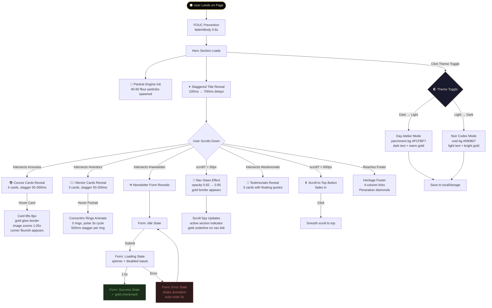
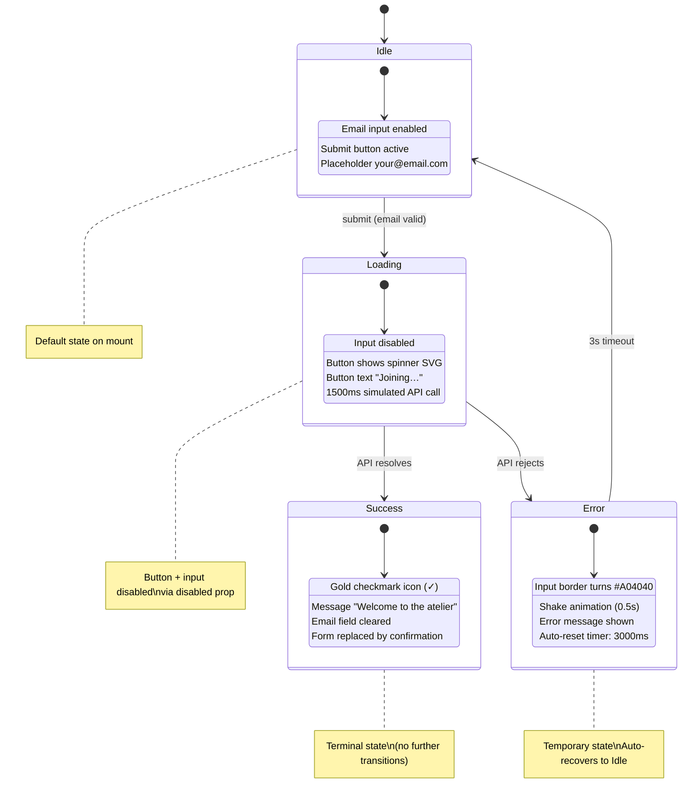
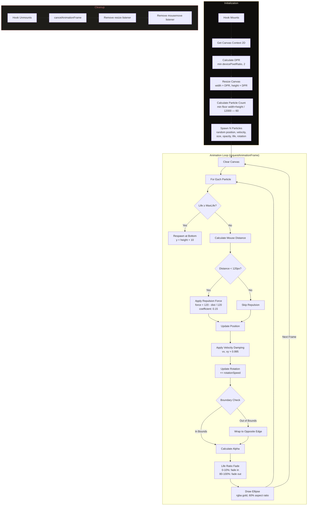

<div align="center">

```
╔══════════════════════════════════════════════════════════════════════╗
║                                                                      ║
║        ◆                                                             ║
║       ◆ ◆          L ' A R T I S A N                                ║
║      ◆   ◆                                                          ║
║       ◆ ◆          B A K I N G   A T E L I E R                      ║
║        ◆                                                             ║
║                    ─── Singapore ───                                 ║
║                                                                      ║
╚══════════════════════════════════════════════════════════════════════╝
```

**A cinematic e-commerce platform for artisan baking education**

*Where heritage meets mastery — built on the "Noir Artisanal Codex" design system*

[](https://react.dev)
[](https://www.typescriptlang.org)
[](https://tailwindcss.com)
[](https://vite.dev)
[](#license)

</div>

---

## Table of Contents

- [Overview](#overview)
- [Design Philosophy](#design-philosophy)
- [Features](#features)
- [Quick Start](#quick-start)
- [Architecture](#architecture)
  - [File Hierarchy](#file-hierarchy)
  - [Key Files Reference](#key-files-reference)
  - [Component Taxonomy](#component-taxonomy)
- [User Interaction Flow](#user-interaction-flow)
- [Application Logic Flow](#application-logic-flow)
  - [Scroll Animation Lifecycle](#scroll-animation-lifecycle)
  - [Newsletter Form State Machine](#newsletter-form-state-machine)
  - [Particle Physics Engine](#particle-physics-engine)
- [Design System](#design-system)
  - [Color Palette](#color-palette)
  - [Typography](#typography)
  - [Animation Tokens](#animation-tokens)
  - [Atmospheric Layering](#atmospheric-layering)
- [Deployment](#deployment)
  - [Static Build](#static-build)
  - [Vercel](#vercel)
  - [Netlify](#netlify)
  - [Docker](#docker)
  - [GitHub Pages](#github-pages)
- [Extending the Project](#extending-the-project)
- [Contributing](#contributing)
- [License](#license)
- [Acknowledgments](#acknowledgments)

---

## Overview

**L'Artisan Baking Atelier** is a high-end, single-page e-commerce platform for a Singapore-based artisan baking school. The project serves as both a functional product site and a showcase of the **"Noir Artisanal Codex"** — a bespoke design system that rejects generic UI patterns in favor of cinematic atmosphere, cultural anchoring, and physics-based interactivity.

### What This Project Demonstrates

| Dimension | Implementation |
|-----------|---------------|
| **Visual Design** | Deep void aesthetics (`#090807`) with molten gold accents, Peranakan heritage geometry, letterpress typography effects |
| **Cultural Anchoring** | 7° diagonal section dividers (Peranakan shophouse roof angle), interlocking diamond SVG flourishes, heritage-inspired course content |
| **Physics Simulation** | Real-time HTML5 Canvas flour particle engine with cursor repulsion, life-cycle management, and boundary wrapping |
| **Performance** | Zero JavaScript animation libraries — all transitions are CSS-native; Canvas API for particles only |
| **Theming** | Full dark/light mode with `localStorage` persistence, system preference detection, and cinematic 500ms cross-fade |
| **Accessibility** | WCAG focus-visible indicators, `prefers-reduced-motion` support, semantic HTML5, ARIA labels throughout |
| **Build Output** | Single-file HTML artifact via `vite-plugin-singlefile` — fully portable, zero external dependencies at runtime |

---

## Design Philosophy

> *"The Noir Artisanal Codex is not a theme — it is a conviction. Every pixel earns its place through calculated purpose."*

### The "Anti-Generic" Pledge

This project was built under a strict design mandate:

| Principle | Enforcement |
|-----------|-------------|
| **No Template Aesthetics** | Zero Bootstrap/Material/Shadcn components. Every element is bespoke — from the `CornerFlourish` SVG to the `SectionDivider` geometry |
| **No Safe Typography** | Bodoni Moda (high-contrast serif) for headings with CSS letterpress effect; Instrument Sans (geometric sans) for body — no Inter, Roboto, or system font fallbacks as primary |
| **No Timid Color** | One dominant void (`#090807`) + one accent (gold `#C9A84C`). No evenly-distributed pastel palettes |
| **No Animation Bloat** | No GSAP, Framer Motion, or Lottie. All animations are CSS `@keyframes` + `transition` with custom cubic-bezier curves |
| **Cultural Intentionality** | Peranakan heritage patterns and 7° diagonals aren't decorative — they're structural elements that anchor the design to Singapore's architectural vernacular |

### Atmospheric Concept: "Nuit Éternelle"

The interface evokes a master pâtissier's private study at midnight — where candlelight catches gold leaf on ancient recipe manuscripts, flour particles drift like snow, and every scroll reveals another chapter of the artisan's codex.

- **Dark Mode** ("Noir Codex"): Deep void with volumetric gold light shafts
- **Light Mode** ("Day Atelier"): Warm parchment tones with aged paper texture

---

## Features

### ✦ Visual & Atmospheric
- **4-layer atmospheric background** — Base void + Nanyang paper texture + Peranakan diagonal tile pattern + volumetric radial light gradients
- **Film grain overlay** — Animated SVG noise texture at 3.5% opacity with `steps(10)` timing for cinematic feel
- **Letterpress typography** — Multi-layer `text-shadow` creating an embossed, tactile effect on headings
- **Gold shimmer gradients** — Animated `background-position` shift on hero text with `background-clip: text`
- **Peranakan corner flourishes** — Bespoke SVG ornaments with interlocking diamond geometry

### ✦ Interactive & Dynamic
- **Flour particle physics engine** — Canvas-based simulation with:
  - Mouse-proximity repulsion (120px radius)
  - Velocity damping (0.995 coefficient)
  - Life-cycle fade-in/fade-out
  - Boundary wrapping
  - Device pixel ratio optimization (capped at 2x)
- **Scroll-triggered reveals** — `IntersectionObserver`-powered with staggered delays (50ms–560ms)
- **Concentric pulse rings** — CSS `@keyframes` on mentor portraits with 500ms stagger per ring
- **Course card hover** — 8px lift + gold glow border + image zoom (1.05x scale)
- **Glassmorphic navigation** — `backdrop-filter: blur(20px)` with scroll-triggered opacity shift
- **Scroll spy** — Active section tracking via `IntersectionObserver` with nav indicator

### ✦ Functional
- **Newsletter form** — 4-state machine (idle → loading → success → error) with:
  - Disabled inputs during async operations
  - Animated spinner on submit button
  - Gold checkmark success state
  - Shake animation on error
- **Theme toggle** — Dark/light with `localStorage` persistence + system preference detection
- **Scroll-to-top** — Appears at 600px scroll depth, with smooth scroll behavior
- **Mobile navigation** — Full-screen overlay with cinematic fade transition

### ✦ Performance & Accessibility
- **Zero runtime dependencies** for animation (CSS-only)
- **`prefers-reduced-motion`** — Disables all animations and grain overlay
- **Lazy loading** — All images use `loading="lazy"`
- **Semantic HTML5** — `<section>`, `<nav>`, `<main>`, `<footer>`, `<blockquote>`
- **ARIA attributes** — `aria-label`, `aria-hidden`, `aria-expanded`, `aria-modal`, `role`
- **Focus indicators** — 2px gold outline with 2px offset on all interactive elements
- **Custom scrollbar** — Styled to match the Noir Codex theme

---

## Quick Start

### Prerequisites

| Tool | Version | Purpose |
|------|---------|---------|
| **Node.js** | ≥ 18.0 | JavaScript runtime |
| **npm** | ≥ 9.0 | Package manager (ships with Node.js) |

### Installation

```bash
# 1. Clone the repository
git clone https://github.com/your-username/lartisan-baking-atelier.git
cd lartisan-baking-atelier

# 2. Install dependencies
npm install

# 3. Start development server
npm run dev
```

The development server starts at `http://localhost:5173` with hot module replacement (HMR).

### Available Commands

| Command | Description |
|---------|-------------|
| `npm run dev` | Start Vite dev server with HMR |
| `npm run build` | Production build → `dist/index.html` (single-file) |
| `npm run preview` | Preview production build locally |

---

## Architecture

### File Hierarchy

```
lartisan-baking-atelier/
│
├── index.html                          # HTML shell — font loading, FOUC prevention, mount point
├── package.json                        # Dependencies & scripts
├── tsconfig.json                       # TypeScript strict mode configuration
├── vite.config.ts                      # Vite + Tailwind + SingleFile plugin config
│
└── src/
    ├── main.tsx                        # Application entry — StrictMode + DOM mount
    ├── App.tsx                         # Root layout — atmospheric layers + section composition
    ├── index.css                       # ★ Design System — all tokens, animations, component styles
    │
    ├── hooks/
    │   ├── useHeritageParticles.ts     # Canvas particle physics engine
    │   ├── useScrollAnimation.ts       # IntersectionObserver reveal hook
    │   └── useTheme.ts                 # Dark/light toggle with persistence
    │
    ├── utils/
    │   └── cn.ts                       # clsx + tailwind-merge utility
    │
    └── components/
        ├── GrainOverlay.tsx            # [Atomic]    Film grain noise layer
        ├── CornerFlourish.tsx          # [Atomic]    Peranakan SVG ornament
        ├── SectionHeader.tsx           # [Molecule]  Reusable cinematic section header
        ├── Navigation.tsx              # [Organism]  Scroll-spy nav + theme toggle + mobile menu
        ├── HeroSection.tsx             # [Template]  Particle-enhanced hero with staggered reveal
        ├── CoursesSection.tsx          # [Template]  4-course grid with badge system
        ├── MentorsSection.tsx          # [Template]  3-mentor grid with concentric rings
        ├── TestimonialsSection.tsx      # [Template]  3-testimonial grid with floating quotes
        ├── NewsletterSection.tsx        # [Template]  Email form with 4-state machine
        ├── Footer.tsx                  # [Organism]  Heritage 4-column footer
        └── ScrollToTopButton.tsx       # [Atomic]    Scroll-triggered back-to-top
```

### Key Files Reference

| File | Role | Responsibility |
|------|------|----------------|
| `src/index.css` | **Design System Core** | The heart of the Noir Artisanal Codex. Contains all Tailwind `@theme` tokens (colors, fonts, easing curves, shadows), atmospheric background layers (noise texture, Peranakan tile pattern, volumetric light), grain overlay animation, letterpress/shimmer effects, component-level styles (cards, badges, buttons, inputs), and `prefers-reduced-motion` overrides. ~400 lines of pure CSS. |
| `src/App.tsx` | **Root Compositor** | Composes the single-page layout by stacking atmospheric layers (`atelier-atmosphere`, `volumetric-light`, `GrainOverlay`) behind the main content sections. Manages theme state via `useTheme` and passes `isLight` prop throughout the component tree. |
| `src/hooks/useHeritageParticles.ts` | **Physics Engine** | Self-contained Canvas-based particle simulation. Manages 40–60 flour particles with: position/velocity vectors, mouse-proximity repulsion (120px radius, 0.15 force coefficient), velocity damping (0.995), life-cycle opacity fading, boundary wrapping, and device pixel ratio awareness. Cleans up animation frames and event listeners on unmount. |
| `src/hooks/useScrollAnimation.ts` | **Reveal Controller** | Generic `IntersectionObserver` hook with configurable `threshold` (default 0.15), `rootMargin`, and `triggerOnce` (default true). Returns a `ref` and `isVisible` boolean. Used by every section and card for staggered entrance animations. |
| `src/hooks/useTheme.ts` | **Theme Manager** | Initializes from `localStorage` → system preference → dark fallback. Toggles `.light`/`.dark` class on `<html>`. Persists choice to `localStorage` under key `lartisan-theme`. Exposes `isLight` boolean and `toggleTheme` callback. |
| `src/components/CornerFlourish.tsx` | **Design Token** | The signature decorative element — a Peranakan-inspired SVG with interlocking diamond geometry. Accepts `position` (4 corners via CSS transforms), `isLight` (stroke color adaptation), and optional `className`. Used in HeroSection, NewsletterSection, and CourseCard hover states. |
| `src/components/Navigation.tsx` | **App Shell** | Fixed header with glassmorphic blur, scroll-spy active section tracking (4 sections), theme toggle button, and mobile hamburger menu with full-screen overlay. Scroll-triggered opacity/border changes at 50px threshold. |
| `src/components/CoursesSection.tsx` | **Content Section** | Renders 4 typed `Course` objects in a responsive grid (1→2→4 columns). Each card features: image with hover zoom, difficulty badge with shimmer animation, metadata (duration + level), and gold arrow indicator. |
| `src/components/NewsletterSection.tsx` | **Form Section** | Email subscription form implementing a 4-state machine: `idle` (default), `loading` (1.5s simulated API), `success` (gold checkmark + confirmation), `error` (shake animation + retry). Inputs disabled during loading; button shows spinner. |

### Component Taxonomy

The project follows **Atomic Design** principles adapted for a single-page application:

```
┌─────────────────────────────────────────────────────────────────┐
│  ATOMIC          Indivisible UI elements                       │
│                  GrainOverlay, CornerFlourish, ScrollToTopButton│
│                                                                 │
│  MOLECULE        Composed atoms with a single purpose          │
│                  SectionHeader (label + line + title + subtitle)│
│                                                                 │
│  ORGANISM        Complex, self-contained UI regions            │
│                  Navigation, Footer                             │
│                                                                 │
│  TEMPLATE        Full page sections with data + layout         │
│                  HeroSection, CoursesSection, MentorsSection,   │
│                  TestimonialsSection, NewsletterSection          │
│                                                                 │
│  PAGE            Single composition of all templates           │
│                  App.tsx                                         │
└─────────────────────────────────────────────────────────────────┘
```

---

## User Interaction Flow

The following diagram maps how a user navigates the cinematic scroll experience:



---

## Application Logic Flow

### Scroll Animation Lifecycle

This sequence diagram shows how `useScrollAnimation` drives the reveal-on-scroll pattern used by every section:

```mermaid
sequenceDiagram
    participant Component as React Component
    participant Hook as useScrollAnimation()
    participant Observer as IntersectionObserver
    participant DOM as DOM Element
    participant CSS as CSS Engine

    Component->>Hook: Call hook with options<br/>{threshold: 0.15, triggerOnce: true}
    Hook->>Hook: Initialize state<br/>isVisible = false
    Hook->>Observer: Create observer with threshold
    Hook->>DOM: Attach ref to target element

    Note over DOM: Element has classes:<br/>.reveal-base (opacity:0, translateY:32px)

    rect rgb(20, 20, 15)
        Note right of DOM: User scrolls page...
        DOM->>Observer: Element enters viewport
        Observer->>Observer: Check: isIntersecting?<br/>ratio ≥ 0.15?
        Observer->>Hook: Entry callback fires
        Hook->>Hook: setIsVisible(true)
    end

    Hook->>Component: Re-render with isVisible=true
    Component->>DOM: Add class .reveal-visible
    DOM->>CSS: Trigger transition<br/>opacity: 0→1, translateY: 32→0px<br/>duration: 1s, easing: var(--ease-dramatic)

    Note over CSS: cubic-bezier(0.19, 1, 0.22, 1)<br/>Sharp attack, gentle settle

    rect rgb(15, 20, 15)
        Note right of Observer: triggerOnce = true
        Observer->>Observer: unobserve(element)
        Note right of Observer: Observer disconnected.<br/>No further callbacks.
    end

    Note over Component: For staggered children:<br/>.stagger-1 = 50ms delay<br/>.stagger-2 = 120ms delay<br/>.stagger-3 = 200ms delay<br/>.stagger-4 = 300ms delay
```



### Newsletter Form State Machine

The newsletter subscription form implements a deterministic 4-state machine:



### Particle Physics Engine

The `useHeritageParticles` hook manages a real-time Canvas simulation:



---

## Design System

The complete design system is defined in `src/index.css` using Tailwind CSS v4's `@theme` directive. No `tailwind.config.js` file is used.

### Color Palette

#### Dark Mode — "Noir Codex"

| Token | Hex | Usage |
|-------|-----|-------|
| `--color-void` | `#090807` | Page background — the "eternal night" |
| `--color-void-light` | `#0F0E0C` | Card backgrounds |
| `--color-void-lighter` | `#171613` | Elevated surfaces |
| `--color-void-surface` | `#1E1D19` | Input backgrounds |
| `--color-void-elevated` | `#262520` | Higher-level surfaces |
| `--color-void-border` | `#2E2D27` | Card/section borders |
| `--color-void-muted` | `#3A3830` | Scrollbar thumb, muted text |
| `--color-gold` | `#C9A84C` | Primary accent — the molten gold |
| `--color-gold-dim` | `#9E8338` | Subdued gold (buttons, gradients) |
| `--color-gold-bright` | `#E4C65A` | Bright gold (hover states) |
| `--color-gold-pale` | `#F0DFA0` | Highlight gold |
| `--color-gold-ember` | `#B8860B` | Deep gold (light mode accents) |

#### Light Mode — "Day Atelier"

| Token | Hex | Usage |
|-------|-----|-------|
| `--color-parchment` | `#FCFBF7` | Page background — warm paper |
| `--color-parchment-warm` | `#F7F3EA` | Warm surface layer |
| `--color-parchment-deep` | `#EDE8DA` | Card borders, dividers |
| `--color-parchment-shadow` | `#D8D0BC` | Shadows, scrollbar thumb |
| `--color-parchment-text` | `#2C2A24` | Primary body text |
| `--color-parchment-muted` | `#6B6558` | Secondary/muted text |

#### Semantic

| Token | Hex | Usage |
|-------|-----|-------|
| `--color-success` | `#5B8C5A` | Newsletter success state |
| `--color-error` | `#A04040` | Newsletter error state |

### Typography

| Role | Font Family | Weight | Tracking | Special Treatment |
|------|-------------|--------|----------|-------------------|
| **Headings** | Bodoni Moda | 400–900 | `0.01–0.02em` | Letterpress effect: multi-layer `text-shadow` (dark shadow + gold ambient glow) |
| **Body** | Instrument Sans | 400–700 | Default | Optimized for readability on dark backgrounds with `-webkit-font-smoothing: antialiased` |
| **Labels** | Instrument Sans | 600 | `0.15–0.45em` | Uppercase, extreme tracking, 10px (0.625rem) size |
| **Badges** | Instrument Sans | 600 | `0.18em` | Uppercase with animated shimmer pseudo-element |

### Animation Tokens

| Token | Value | Usage |
|-------|-------|-------|
| `--ease-dramatic` | `cubic-bezier(0.19, 1, 0.22, 1)` | Scroll reveals — sharp attack, gentle settle |
| `--ease-smooth` | `cubic-bezier(0.16, 1, 0.3, 1)` | Hover transitions — controlled energy |
| `--ease-bounce` | `cubic-bezier(0.34, 1.56, 0.64, 1)` | Available for playful micro-interactions |

| Keyframe | Duration | Usage |
|----------|----------|-------|
| `grain-drift` | 8s, `steps(10)` | Film grain position randomization |
| `shimmer` | 6s, ease | Gold gradient text `background-position` cycle |
| `pulse-ring` | 3s, ease-in-out | Mentor concentric circle scale + opacity |
| `float` | 6s, ease-in-out | Testimonial quotation mark gentle drift |
| `badge-shine` | 4s, ease-in-out | Difficulty badge light streak |
| `title-reveal` | Custom | Hero title: translateY + skewY + blur |

### Atmospheric Layering

The background is not a single color — it's a **4-layer composite**:

```
Layer 4 (top)    ─── Volumetric Light ─── Radial gradients simulating golden-hour shafts
Layer 3          ─── Peranakan Grid ──── repeating-linear-gradient at 7° and 97° angles
Layer 2          ─── Paper Texture ───── SVG feTurbulence fractal noise at 2.5% opacity
Layer 1 (base)   ─── Void Color ──────── #090807 (dark) / #FCFBF7 (light)

+ Film Grain     ─── GrainOverlay ────── Fixed, 200% oversized, animated via steps()
```

Each layer is implemented as a CSS pseudo-element or dedicated `<div>`, using `position: fixed` with `pointer-events: none` and explicit `z-index` stacking.

---

## Deployment

### Static Build

The project uses `vite-plugin-singlefile` to produce a **single, self-contained `index.html`** file. All CSS, JavaScript, and SVG assets are inlined. Images are loaded from external URLs (Unsplash CDN).

```bash
npm run build
```

**Output:** `dist/index.html` (~180KB gzipped)

This single file can be hosted on any static file server, CDN, or even opened directly in a browser.

### Vercel

```bash
# Option A: Vercel CLI
npm i -g vercel
vercel

# Option B: Git integration
# 1. Push to GitHub
# 2. Import project at vercel.com/new
# 3. Framework Preset: Vite
# 4. Build Command: npm run build
# 5. Output Directory: dist
```

**`vercel.json`** (optional, for SPA routing):
```json
{
  "rewrites": [{ "source": "/(.*)", "destination": "/index.html" }]
}
```

### Netlify

```bash
# Option A: Netlify CLI
npm i -g netlify-cli
netlify deploy --prod --dir=dist

# Option B: Git integration
# 1. Push to GitHub
# 2. Import at app.netlify.com
# 3. Build Command: npm run build
# 4. Publish Directory: dist
```

**`netlify.toml`** (optional):
```toml
[build]
  command = "npm run build"
  publish = "dist"

[[redirects]]
  from = "/*"
  to = "/index.html"
  status = 200
```

### Docker

```dockerfile
# Dockerfile
FROM node:20-alpine AS builder
WORKDIR /app
COPY package*.json ./
RUN npm ci
COPY . .
RUN npm run build

FROM nginx:alpine
COPY --from=builder /app/dist /usr/share/nginx/html
EXPOSE 80
CMD ["nginx", "-g", "daemon off;"]
```

```bash
# Build and run
docker build -t lartisan-atelier .
docker run -p 8080:80 lartisan-atelier
```

### GitHub Pages

```bash
# 1. Build the project
npm run build

# 2. Deploy dist/ to gh-pages branch
npx gh-pages -d dist
```

Or configure GitHub Actions:

```yaml
# .github/workflows/deploy.yml
name: Deploy to GitHub Pages
on:
  push:
    branches: [main]

jobs:
  deploy:
    runs-on: ubuntu-latest
    steps:
      - uses: actions/checkout@v4
      - uses: actions/setup-node@v4
        with:
          node-version: 20
      - run: npm ci
      - run: npm run build
      - uses: peaceiris/actions-gh-pages@v3
        with:
          github_token: ${{ secrets.GITHUB_TOKEN }}
          publish_dir: ./dist
```

---

## Extending the Project

### Adding New Design Tokens

Modify `src/index.css` within the `@theme` directive. **Do not** create a `tailwind.config.js` — Tailwind v4 uses CSS-native configuration.

```css
/* src/index.css */
@theme {
  --color-new-accent: #123456;
  --ease-new-curve: cubic-bezier(0.4, 0, 0.2, 1);
}
```

### Adding a New Section

1. Create `src/components/NewSection.tsx`
2. Use `useScrollAnimation` for reveal behavior
3. Use `SectionHeader` for consistent heading treatment
4. Add the section to `src/App.tsx` inside `<main>`
5. Add a nav link in `Navigation.tsx` → `NAV_LINKS` array
6. Include a `.section-divider` at the top for visual continuity

### Adding New Fonts

1. Add the Google Fonts `<link>` to `index.html`
2. Register the font in `@theme`:
   ```css
   @theme {
     --font-new: "New Font", serif;
   }
   ```
3. Use via Tailwind: `font-[family-name:var(--font-new)]` or create a utility class in `index.css`

---

## Contributing

### Code Standards

| Rule | Enforcement |
|------|-------------|
| **TypeScript Strict Mode** | `tsconfig.json` — `strict: true`, `noUnusedLocals`, `noUnusedParameters` |
| **No `any`** | Use `unknown` with type narrowing |
| **Functional Components** | No class components — hooks only |
| **CSS-First Animation** | No JS animation libraries — use CSS `@keyframes` + `transition` |
| **Library Discipline** | No redundant component rebuilds — extend existing atoms |
| **Semantic HTML** | Every interactive element must have ARIA attributes |
| **Early Returns** | Avoid nested conditionals — return early |

### Pull Request Process

1. Fork the repository
2. Create a feature branch: `git checkout -b feature/your-feature`
3. Make changes following the code standards above
4. Ensure `npm run build` succeeds with zero errors
5. Submit a PR with:
   - Clear description of changes
   - Screenshots for visual changes
   - Rationale for design decisions

---

## License

This project is licensed under the **MIT License**.

```
MIT License

Copyright (c) 2026 L'Artisan Baking Atelier

Permission is hereby granted, free of charge, to any person obtaining a copy
of this software and associated documentation files (the "Software"), to deal
in the Software without restriction, including without limitation the rights
to use, copy, modify, merge, publish, distribute, sublicense, and/or sell
copies of the Software, and to permit persons to whom the Software is
furnished to do so, subject to the following conditions:

The above copyright notice and this permission notice shall be included in all
copies or substantial portions of the Software.

THE SOFTWARE IS PROVIDED "AS IS", WITHOUT WARRANTY OF ANY KIND, EXPRESS OR
IMPLIED, INCLUDING BUT NOT LIMITED TO THE WARRANTIES OF MERCHANTABILITY,
FITNESS FOR A PARTICULAR PURPOSE AND NONINFRINGEMENT. IN NO EVENT SHALL THE
AUTHORS OR COPYRIGHT HOLDERS BE LIABLE FOR ANY CLAIM, DAMAGES OR OTHER
LIABILITY, WHETHER IN AN ACTION OF CONTRACT, TORT OR OTHERWISE, ARISING FROM,
OUT OF OR IN CONNECTION WITH THE SOFTWARE OR THE USE OR OTHER DEALINGS IN THE
SOFTWARE.
```

---

## Acknowledgments

### Typography
- **[Bodoni Moda](https://fonts.google.com/specimen/Bodoni+Moda)** — Owen Earl, designed after Giambattista Bodoni's 18th-century typefaces
- **[Instrument Sans](https://fonts.google.com/specimen/Instrument+Sans)** — Rodrigo Fuenzalida & Jordan Egstad

### Photography
- All course and portrait images sourced from **[Unsplash](https://unsplash.com)** under the [Unsplash License](https://unsplash.com/license)

### Technical Foundation
- **[React 19](https://react.dev)** — Meta Open Source
- **[Vite 7](https://vite.dev)** — Evan You & contributors
- **[Tailwind CSS 4](https://tailwindcss.com)** — Adam Wathan & Tailwind Labs
- **[vite-plugin-singlefile](https://github.com/nicepkg/vite-plugin-singlefile)** — Richard Willars

### Cultural Inspiration
- **Peranakan Architecture** — The shophouses of Katong, Joo Chiat, and Emerald Hill, Singapore
- **7° Diagonal** — Derived from the characteristic roof pitch of Peranakan-era terrace houses

---

<div align="center">

```
◆ ◆ ◆
```

*Crafted with intention in Singapore*

**L'Artisan Baking Atelier** — *Where heritage meets mastery*

</div>
